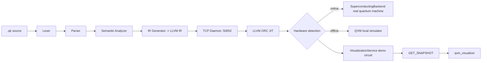

# Quark — Quantum Programming Language

[中文](./README.md)

Quark (`.qk`) is an experimental programming language targeting **quantum computing + neural interfaces + quantum language models + quantum robotics**. This repository ships a full **VS Code language extension**, an **LLVM ORC JIT runtime**, a **CLI toolchain**, a **web inference UI**, a **Go installer**, a **real-time quantum visualizer**, the **VedaROS quantum robotics operating system**, and the **QbNS quantum brain network**.

---

## ✨ Features

| Feature | Description |
| --- | --- |
| Quantum programming | Qubit allocation, quantum objects, measurement, Bell states, quantum registers (`Qubit` / `QObject` / `measure` / `DiracState` / `BellState` / `QuantumRegister`) |
| Quantum HAL | Auto-detect real quantum machines (FPGA superconducting / trapped-ion / neutral-atom backends), otherwise fall back to the local QVM simulator |
| Quantum Language Model (QLM) | Variational quantum circuit training, model export (`.qkm`), text ↔ quantum-state encoding/decoding |
| Brain-Computer Interface (BCI) | `mind_read` / `mind_train` / `mind_feedback` — encode neural signals into quantum states via the QbNS Transducer |
| QbNS Quantum Brain Network | `Transducer` (neural→quantum encoding), `Rmx` (distributed hybrid network), `qbw` (brain quantum waves / quantum streams / distribution links) |
| VedaROS Quantum Robotics OS | A ROS-like quantum distributed OS: QDDP decentralized protocol, rclcpp-like client library, qk custom language, transform tree, behavior-tree navigation, entangled-consciousness planning, hardware abstraction |
| Real-time quantum visualizer | `qvm_visualizer`: six live windows — circuit grid, state vector, Bloch sphere, quantum objects, measurement history, metrics |
| JIT execution | Just-in-time compilation via LLVM ORC JIT |
| AOT compilation | `qk compile` compiles scripts to native binaries (x32 / x64 / arm64) |
| `.mmi` module system | `mod` / `use` / `import` / `export` / `requires` module declarations & imports/exports, packaged as `.mmi` modules (QKMM format) loaded and invoked at runtime |
| Rust-style type system | `form` / `trait` / `impl` / `template` / `rank` declarative types, generics, and trait implementations |
| Quantum gate intrinsics | Built-in `x` `h` `rz` `cnot` `toffoli` `swap` `qft` `braid` gates and `measure_x` / `measure_y` measurements |
| HTTP inference server | `qk serve` exposes OpenAI-compatible `chat/completions`, `embeddings`, `models` endpoints |
| Web chat UI | Streaming inference chat UI built with Vite + Tailwind + Dexie |
| Toolchain manager | `quarkup` installer and version proxy written in Go |
| quarkSE editor | A lightweight qk desktop editor (Electron + CodeMirror), reusing the language server pipeline with file open/save/run |
| quarkRSP simulation platform | A quantum robotics simulation platform: physics kernel (QM/QVM), Vulkan PBR rendering, blueprint editing, QCDRC teleoperation, quantum RL, consciousness control |
| quarkRSP Qt GUI | A Qt 6 + QVulkanWindow desktop simulation UI: real 3D viewport, World Outliner / Details panels, teleoperation / RL / consciousness control |
| Prosthetic limb / Bionic eye | Brain-controlled prosthetic limb (`ProstheticLimb`, EMG-driven) and bionic eye (`BionicEye`, EEG-driven) assisted by quantum RL (reusing `QuantumRLAgent` + `ConsciousnessController`), with physical robot driving and a bionic-eye camera |

---

## 📁 Repository Layout

```
quark-vscode/
├── client/                    VSCode extension client (LanguageClient)
├── server/                    Language server: lexer / parser / semantic / IR / mmi / CLI / HTTP API router
│   └── qk.cmd                 `qk` CLI entry point (Windows)
├── runtime/                   C++20 runtime: LLVM ORC JIT + Quantum Hardware Abstraction Layer (QHAL)
│   ├── src/                   Entry points & C ABI core (main.cpp / runtime_api.cpp / QObject.hpp / QDataEncoder.hpp)
│   └── include/
│       ├── qhal/              Quantum HAL (QM / QVM / JIT / SandboxJIT / MMI / VisualizationService / physical backends)
│       ├── qbNs/              Quantum Brain Network QbNS (Transducer / Rmx / qbw brain waves / qbNSBridge)
│       ├── vedaRos/           Quantum Robotics OS VedaROS (core / bridge / algorithm / hardware / quantum)
│       ├── gui/               Real-time quantum visualizer (protocol / components / windows / src)
│       ├── qlm/               Quantum Language Model QLM
│       ├── qml/               Quantum ML primitives (Layer / QKMFormat / Inference)
│       ├── numqk/             Numerical tensor library Numqk (Tensor / Autograd / SoftLogic)
│       ├── spacetime/         Spacetime differential-geometry solvers (Foliation / Integrators / KaluzaKlein / NeuralField / SpectralEEG / TachyonField, etc.)
│       ├── verify/            Static verifier (Verifier / SmtLibEmitter / IntervalAbstract)
│       ├── stub/              Stub implementations (nabStub.hpp)
│       └── utils/             Utilities (FastPhaseRetrieval / Ga)
├── quarkSE/                   Lightweight qk desktop editor (Electron + CodeMirror, reusing server pipeline)
│   ├── src/                   Electron main process + pipeline reuse + daemon connection
│   └── renderer/              CodeMirror editor + output Shell + status bar
├── quarkRSP/                  Quantum robotics simulation platform (C++20, as a new runtime target)
│   ├── include/               core / qpc / qpu / circuit / blueprint / pcg / render / editor / control / bridge / qcdrc
│   ├── src/                   Entry points, Vulkan context, JIT host, stb_image impl, RL demo
│   ├── gui/                   Qt 6 simulation UI (qt windows + simulation_host kernel)
│   ├── shaders/               PBR shaders (GLSL)
│   └── tests/                 Unit tests (87 cases / 24 suites)
├── quark-web-ui/              Web inference chat UI (Vite + Tailwind + Dexie)
├── installer/                 Go toolchain installer / version proxy (quarkup)
├── scripts/                   Build / signing scripts (sign.ps1, deploy-wdac, Linux build & install)
├── examples/                  Example `.qk` programs
├── syntaxes/                  TextMate syntax highlighting
├── vendor/                    Third-party libraries (GLFW, Nuklear, etc.)
└── vcpkg/                     vcpkg dependency management
```

---

## ⚠️ Before You Build

> **Important**: The `.vscode/*.json`, `runtime/.clangd`, and `runtime/CMakeLists.txt` files in this repository contain **absolute paths** from the author's machine (Kokkos, CUDA, LLVM, GLFW, compiler locations, etc.). **Developers must update these files to match their own installation paths before building.** Do not use the hard-coded paths as-is.

Locations to change:

| File | Items to change |
| --- | --- |
| `runtime/CMakeLists.txt` | `Kokkos_DIR` (line 58, `C:/Libraries/kokkos/lib/cmake/Kokkos`), GLFW library dir `lib-vc2026` (line 48) |
| `quarkRSP/CMakeLists.txt` | `Qt6_DIR` (line 127, `C:/Qt/6.11.2/msvc2022_64/lib/cmake/Qt6`, only needed to build `quarkRSP_gui`) |
| `runtime/.clangd` | Kokkos / CUDA `-I` include paths (lines 7-8) |
| `.vscode/c_cpp_properties.json` | `compilerPath`, Kokkos/CUDA/LLVM `includePath` |
| `.vscode/settings.json` | `cmake.sourceDirectory` (workspace absolute path) |

See [🛠️ Dependencies & Build](#-dependencies--build) for how to download and compile dependencies.

---

## 🚀 Quick Start

### 1. VS Code Extension

```bash
npm install
npm run compile        # Compile client & server (tsc -b)
```

Press `F5` in VS Code to launch the extension in debug mode, or package it with `vsce package`. Opening any `.qk` file provides syntax highlighting, autocompletion, and semantic diagnostics.

- **Run script**: `Ctrl+Alt+N` (macOS: `Cmd+Alt+N`) or click the ▶ button in the top-right of the editor.

### 2. C++ Runtime

The runtime depends on **LLVM**, **Kokkos**, and **Vulkan + GLFW + Nuklear**. See [🛠️ Dependencies & Build](#-dependencies--build) for the full dependency list and build instructions.

> ⚠️ Follow [Before You Build](#-before-you-build) to update hard-coded paths, or override them via command-line `-D` flags.

```bash
cd runtime
cmake -B build -S . -G "Ninja" \
  -DCMAKE_CXX_COMPILER="<your clang-cl / g++ / clang++ path>" \
  -DCMAKE_TOOLCHAIN_FILE="<your vcpkg path>/scripts/buildsystems/vcpkg.cmake" \
  -DLLVM_DIR="<your LLVM cmake directory>" \
  -DKokkos_DIR="<your Kokkos install>/lib/cmake/Kokkos" \
  -DCUDAToolkit_ROOT="<your CUDA install directory>"
cmake --build build --config Release --parallel
```

The build produces the following targets:

| Target | Type | Description |
| --- | --- | --- |
| `quark_rt` | Shared library | Quantum core (LLVM ORC JIT + QHAL + Kokkos), exporting a C ABI (`RuntimeApi.h`) |
| `runtime` | Executable | Shell: socket daemon (`--daemon` listens on `localhost:50052`) + stdin interaction, calling `quark_rt` via the C ABI |
| `qvm_visualizer` | Executable | Real-time quantum visualizer (Vulkan + GLFW + Nuklear) |
| `transmitter` | Executable | QLM transmitter |
| `quarkRSP` | Executable | Quantum robotics simulation platform main program (physics kernel + Vulkan PBR rendering + blueprints + teleoperation) |
| `quarkRSP_rl_demo` | Executable | End-to-end quantum RL training demo (real QVM backend) |
| `quarkRSP_tests` | Executable | quarkRSP unit tests (87 cases / 24 suites) |
| `quarkRSP_sim` | Static library | Simulation kernel (physics / teleoperation / RL / QVM / consciousness, requires Qt 6) |
| `quarkRSP_gui` | Executable | Qt 6 desktop simulation UI (requires Qt 6, optional) |

- **Foreground mode (stdin/stdout)**: `./runtime`
- **Daemon mode**: `./runtime --daemon` (used by CLI, API service, and visualizer)

### 3. Command-Line Tool

`server/qk.cmd` maps `qk` to the compiled `server/out/cli.js`:

```bash
qk run <script.qk>                                  # Run a script
qk ir <script.qk>                                   # Emit LLVM IR to stdout (no daemon connection)
qk compile <x32|x64|arm64> <-e|-m> <script.qk>      # Compile to native binary (-e executable / -m hybrid library)
qk verify <script.qk>                               # Statically verify contracts (requires/ensures/invariant)
qk verify <script.qk> --smt [out.smt2]              # Export SMT-LIB for external solvers (Z3/cvc5)
qk serve <model.qkm> [--port <port>]                # Start HTTP inference server (default 9080)
```

### 4. Real-time Quantum Visualizer

The visualizer connects to the daemon (`localhost:50052`) over a socket to read real QVM state:

```bash
# Terminal 1: start the daemon (runs a 5-qubit demo circuit)
./runtime --daemon

# Terminal 2: start the visualizer
./qvm_visualizer
```

See [🖥️ QVM Visualizer](#-qvm-visualizer) for the six windows.

### 5. Web Inference UI

```bash
cd quark-web-ui
npm install
npm run dev          # Development mode
npm run build        # Production build
```

The UI connects to `http://localhost:9080/v1/chat/completions` by default; start the inference server first with `qk serve`.

### 6. quarkSE Editor

A lightweight qk desktop editor, reusing the language server pipeline:

```bash
cd quarkSE
npm install
npm start          # Compile and launch the Electron editor
```

Start the daemon `./runtime --daemon` before running scripts. The editor supports opening/saving `.qk` files, syntax highlighting (CodeMirror), live diagnostics, and one-click run.

### 7. quarkRSP Simulation Platform

The quantum robotics simulation platform builds as a new runtime target (configure paths per [Before You Build](#-before-you-build) first):

```bash
cd runtime
cmake --build build --target quarkRSP            # simulation platform main program
cmake --build build --target quarkRSP_rl_demo    # end-to-end quantum RL demo
cmake --build build --target quarkRSP_tests      # unit tests
ctest -R quarkRSP_tests                          # run tests (87 cases / 24 suites)
```

See [🤖 quarkRSP Simulation Platform](#-quarkrsp-simulation-platform) for architecture details.

---

## 🧩 Language Reference

### Types

`int8` `int16` `int32` `int64` `uint8` `uint16` `uint32` `uint64` `float` `double` `string` `char` `Qubit` `QObject` `QModel` (plus `auto` / `let` type inference)

### Control Flow

`let` `auto` `int` `new` `return` `if` `else` `while` `for`

### Built-in Functions

| Function | Signature | Returns | Description |
| --- | --- | --- | --- |
| `alloc` | `alloc()` | `Qubit` | Allocate a qubit |
| `measure` | `measure(<Qubit>)` | `int` | Collapse & measure a qubit |
| Quantum gates | `x` `h` `rz` `cnot` `toffoli` `swap` `qft` `braid` | — | Built-in quantum gate operations |
| Quantum measurements | `measure_x` / `measure_y` | `int` | X / Y basis measurements |
| `encode_text` | `encode_text(string)` | `QObject` | Encode text into a quantum state |
| `encode_image` | `encode_image(string)` | `QObject` | Encode an image into a quantum state |
| `qk_encode_string` | `qk_encode_string(string)` | `QObject` | String → quantum object |
| `qk_decode_string` | `qk_decode_string(QObject)` | `string` | Quantum object → string |
| `qlm_load` | `qlm_load(string)` | `QModel` | Load a QLM model (`.qkm`) |
| `qlm_forward` | `qlm_forward(QModel, QObject)` | `void` | QLM forward inference |
| `qlm_invoke` | `qlm_invoke(QObject, int, double)` | `QModel` | Train the variational quantum circuit |
| `mind_read` | `mind_read(string)` | `QObject` | Read brain signals & encode into a quantum state (`stream/spike/lfp/eeg/sensor`) |
| `mind_train` | `mind_train(QObject, int, double)` | `void` | Train QLM from a brain state & export |
| `mind_feedback` | `mind_feedback(QObject)` | `void` | Measure a brain state, closing the neurofeedback loop |
| `veda_qlm_train` | `veda_qlm_train(QObject, int, double)` | `void` | Train via the VedaROS QLM integration |

### Built-in Classes

`DiracState` `BellState` `QuantumRegister` (instantiated with `new`, support member access such as `.measure()`)

### Module System (`.mmi`)

Declarations, imports, and exports for support modules, and can be packaged as `.mmi` modules (QKMM format) for dynamic loading and invocation at runtime:

```qk
// Define and export a module
mod math {
    pub int32 add(int32 a, int32 b) {
        return a + b;
    }
    export int32 square(int32 x) {
        return x * x;
    }
}
```

```qk
// Import a .mmi module and invoke it
import math from "./math.mmi";
requires io.network;      // declare required permissions
let result = math.add(1, 2);
```

- Keywords: `mod` (module), `use` (path import), `pub` (public), `import` + `from` (import `.mmi`), `export` (export), `requires` (permission declaration)
- The `.mmi` header (`name` / `version` / `exports` / `permissions` / `imports`) is packed by the language server (`server/src/mmi.ts`) and loaded/invoked by the runtime (`qhal/MMI.hpp`) through the C ABI (`RuntimeApi.h` `quark_runtime_*_mmi`)

### Type Definitions (form / trait / impl)

Declarative type system:

| Keyword | Description |
| --- | --- |
| `form` | Define a data structure, supporting inheritance (`inherits`) and `rank` |
| `trait` | Define a shareable behavior interface |
| `impl` | Implement a trait for a type (`impl <trait> for <type>`) |
| `template` | Generic declaration |
| `self` | Method receiver (`self` / `&self`) |

### Entry Point

Every program must define `quark_main`:

```qk
int32 quark_main() {
    return 0;
}
```

### Examples

```qk
// Example 1: Bell state statistics (examples/FivemBell.qk)
int32 quark_main() {
    int32 iterations = 50000;
    int32 total_ones = 0;
    auto massive_reg = new QuantumRegister(15);

    int32 count = 0;
    while (count < iterations) {
        auto bell_pair = new BellState();
        total_ones = total_ones + bell_pair.measure();
        count = count + 1;
    }
    return total_ones;
}
```

```qk
// Example 2: Mind-controlled programming (examples/mind_controlled.qk)
let brain_state = mind_read("eeg");     // EEG -> quantum state
let bits = brain_state.measure;         // mind-driven measurement
mind_train(brain_state, 200, 0.01);     // train QLM from the brain state
mind_feedback(brain_state);             // neurofeedback
```

```qk
// Example 3: VedaROS QLM training (examples/veda_qlm.qk)
let brain = mind_read("eeg");           // EEG -> quantum state
let model = qlm_invoke(brain, 10, 0.01); // QLM invocation
model.export("brain_model.qkm");        // export model
veda_qlm_train(brain, 200, 0.01);       // VedaROS QLM training
```

---

## ⚙️ Architecture



**Compilation pipeline**: `Lexer → Parser → SemanticAnalyzer → IRGenerator → LLVM IR → JIT Daemon (port 50052) → execution`

**VS Code run flow**: editor ▶ button → `quark/runCode` notification → language server generates LLVM IR → `spawn('quark')` forwards to the daemon → output echoes to the "Quark Console".

**Real-time visualization data flow**: the `VisualizationService` inside the daemon evolves a 5-qubit demo circuit on a real `qhal::QVM`, serializes the state vector / gate events / measurement results / object list into a snapshot, and serves it to `qvm_visualizer` via the `GET_SNAPSHOT` command.

---

## 🎮 quarkRSP — Quantum Robotics Simulation Platform

`quarkRSP/` is a quantum robotics simulation platform (C++20, built as a new runtime target), reusing `qhal` (QM/QVM), `vedaRos`, and `numqk`.

| Subsystem | Location | Description |
| --- | --- | --- |
| Physics kernel qpc | `include/qpc/` | Rigid-body dynamics + collision detection + constraint solving (AlphaPHY-inspired), quantum interface delegated to QM/QVM |
| Vulkan rendering | `include/render/` | 3D rendering + PBR (Cook-Torrance) + texture sampling + OBJ/glTF/glb loading + built-in PNG/JPEG decoding |
| Blueprint editing | `include/blueprint/` | Behavior tree + Material/Substrate node graphs + Nuklear visual editor |
| QPU/QPL design | `include/qpu/` | Quantum processor & programming layer designer |
| Robot circuit | `include/circuit/` | Robot circuit design & wiring |
| PCG framework | `include/pcg/` | Seed-driven procedural content generation |
| Control & RL | `include/control/` | Quantum RL agent + end-to-end training pipeline + real physics environment + consciousness control + qbNs bridge + prosthetic/bionic eye + field-consciousness control |
| Hardware abstraction | `include/hardware/` | Actuators / bio-signals (EMG/EEG) / safety controller / fault detection / observability / HIL harness |
| QCDRC teleoperation | `include/qcdrc/` | RGB camera sampling + full-body motion capture + IK/action mapping + behavioral cloning + real device integration (OpenCV/ExternalMocap) |

Unified entry point: `#include "quarkRSP.hpp"`.

### 🦾 Prosthetic Limb / Bionic Eye (brain-controlled + quantum RL)

`include/control/prosthetic.hpp` / `prosthetic_driver.hpp` provide brain-controlled prosthetic limbs and bionic eyes, reusing `QuantumRLAgent` (quantum exploration) and `ConsciousnessController` (brain quantum waves → arousal modulation):

| Component | Description |
| --- | --- |
| `ProstheticLimb` | Prosthetic limb: brain "intent" → target joint angles, quantum RL learns flexion/grasp compensation |
| `BionicEye` | Bionic eye: brain-controlled gaze direction (pan/tilt), quantum RL learns tracking compensation |
| `BionicEyeCamera` | Bionic-eye camera: implements `ICamera`, emits real RGB frames that follow the gaze direction |
| `ProstheticRobotDriver` | Prosthetic → Robot rigid-body driving (joint angles mapped to bone orientations) |
| `ProstheticEnvironment` / `ProstheticPhysicsEnvironment` | End-to-end quantum RL environments plugged into `RLPipeline` |

Safety and clinical compliance are documented in [SAFETY.md](quarkRSP/SAFETY.md) (ISO 14971 risk analysis / FMEA) and [CLINICAL.md](quarkRSP/CLINICAL.md) (FDA/CE clinical evaluation plan).

### 🖥️ quarkRSP Qt GUI

In addition to the command-line main program, `quarkRSP_gui` provides a desktop simulation UI built on **Qt 6 Widgets + QVulkanWindow** (requires Qt 6, see [🛠️ Dependencies & Build](#-dependencies--build)):

| Component | Location | Description |
| --- | --- | --- |
| Simulation kernel | `gui/src/simulation_host.hpp/.cpp` | `SimulationHost`: physics stepping / teleoperation / RL training / QVM / consciousness & brain bridge |
| Qt main window | `gui/qt/main_window.cpp` | QTabWidget panel layout |
| Vulkan viewport | `gui/qt/vulkan_viewport.cpp` | QVulkanWindow real 3D rendering viewport |
| Panels | `gui/qt/panels.cpp` | World Outliner / Details panels with entity-selection linkage |

Qt runtime DLLs are auto-deployed via `windeployqt` at build time, followed by automatic code signing (see [🔐 Code Signing & WDAC](#-code-signing--wdac)).

---

## ✍️ quarkSE — Lightweight qk Editor

`quarkSE/` is a lightweight qk desktop editor (Electron + CodeMirror 6).

- **Pipeline reuse**: references `server/src` lexer / parser / semantic / ir via `rootDir: ".."`, zero code duplication
- **File operations**: open / save `.qk` files (native Electron dialogs)
- **Run**: generate LLVM IR → connect to the daemon (`localhost:50052`) → output echoed to the Shell window
- **Editor**: CodeMirror 6 syntax highlighting + live diagnostics + dirty-state tracking

---

## 🤖 VedaROS — Quantum Robotics OS

`runtime/include/vedaRos/` implements a ROS-like distributed robotics operating system deeply integrated with quantum computing. It replaces DDS with **QDDP (Quantum-classical Decentralized Distributed Protocol)**, supports communication with QbNS brain quantum waves, and provides an rclcpp-like client library.

| Module | File | Description |
| --- | --- | --- |
| Type system | `core/types.hpp` | Type-safe serialization, quantum-classical dual-channel payload |
| Transport | `core/quantum_transport.hpp` | QDDP decentralized node communication (`Endpoint` / `QMessage`) |
| Client library | `core/node.hpp` | rclcpp-like `Node`: pub/sub / service / action / executor |
| Custom language | `core/qk_lang.hpp` | Define consciousness/thought/decision/message/service/action in qk; compile-time codegen for real quantum devices (gate sequences) and QVM (C++) |
| Brain-wave bridge | `bridge/brain_wave_bridge.hpp` | Bridge QbNS brain quantum waves into the VedaROS node network |
| Transform tree | `algorithm/tf_tree.hpp` | Innovative quantum-classical coordinate transform tree |
| Behavior-tree navigation | `algorithm/behavior_tree.hpp` | Multi-parallel behavior-tree navigation path planning |
| Entangled planner | `algorithm/entangled_planner.hpp` | Motion planning & operation via fully entangled consciousness |
| Mean-flow planner | `algorithm/meanflow_planner.hpp` | Mean-flow planner |
| Unified loss | `core/unified_loss.hpp` | Unified loss framework |
| Hardware abstraction | `hardware/hardware_abstraction.hpp` | Hardware abstraction layer + fixed-frequency control loop |
| Actuator/sensor | `hardware/actuator_sensor.hpp` | Unified motor/sensor interface (incremental encoder sampling) |
| QLM integration | `quantum/qlm.hpp` | VedaROS QLM wrapper + `qk_veda_qlm_train` ABI |

Unified entry point: `#include "vedaRos/vedaRos.hpp"`.

---

## 🧠 QbNS — Quantum Brain Network

`runtime/include/qbNs/` implements a quantum hybrid architecture for brain-computer interfaces (BMI), supporting four modalities (non-invasive / invasive / wireless / quantum sensor).

| Component | File | Description |
| --- | --- | --- |
| Neural encoder | `Transducer.hpp` | Encode neural signals (`NeuralStream` / `SpikeTrain` / `LFP` / `EEGSpectrum` / `QuantumSensorReading`) into quantum states |
| Spike belief propagation | `SpikeBeliefPropagation.hpp` | Belief propagation over spike signals |
| Distributed network | `rmx.hpp` | `Rmx`: brain-node / QC-node registration, adaptive routing, real-time control loop |
| Brain quantum wave | `qbw.hpp` | `BrainQuantumWave`: retrieve quantum objects to build quantum streams, establish distribution links |
| Top-level interface | `qbNs.hpp` | `QbNS`: unified hybrid architecture facade |
| C bridge | `qbNSBridge.hpp` | ABI exports for `qk_mind_read` / `qk_mind_train` / `qk_mind_feedback` |

---

## 🖥️ QVM Visualizer

`qvm_visualizer` is a real-time quantum visualization app built on Vulkan + GLFW + Nuklear, reading real quantum state from the daemon over a socket.

Six observation windows:

| Window | Observes |
| --- | --- |
| Quantum Circuit | Quantum circuit / gate sequence |
| State Vector | Per-basis amplitudes (real/imag) + probability histogram (full display up to 8 qubits) |
| Bloch Sphere | Single-qubit Bloch sphere projection (θ/φ) |
| Quantum Objects | Live quantum object list (type + qubit id) |
| Measurement History | Measurement outcome time series / distribution |
| Metrics | FPS, frame time, connection status, generation, present mode |

**Performance optimizations**: multiple frames in flight (per-frame `VkFence` instead of `vkQueueWaitIdle`), `VK_PRESENT_MODE_MAILBOX` low-latency presentation, snapshot generation counters to avoid redundant copies, delta-time throttling.

**Shared protocol**: `runtime/include/gui/protocol.hpp` defines the zero-dependency `StateSnapshot` line protocol between the daemon and the visualizer (`GET_SNAPSHOT` → `END_SNAPSHOT`).

---

## 🔌 Inference API

`qk serve <model.qkm>` exposes OpenAI-compatible endpoints:

| Method | Endpoint | Description |
| --- | --- | --- |
| `GET` | `/v1/models` | List models |
| `POST` | `/v1/chat/completions` | Chat completions (supports `stream: true` SSE) |
| `POST` | `/v1/embeddings` | Text embeddings |

---

## 🔐 Code Signing & WDAC

`scripts/` provides Windows code-signing and WDAC (Windows Defender Application Control) deployment scripts, used to allow self-built executables on WDAC-enforced hosts:

| File | Description |
| --- | --- |
| `scripts/sign.ps1` | Signs targets with a self-signed certificate (`scripts/certs/quark-codesign.pfx`) via `signtool` |
| `scripts/deploy-wdac.ps1` | Deploys the WDAC supplemental policy (`scripts/wdac/supplemental.cip`), requires administrator privileges |
| `scripts/deploy-wdac-fix.ps1` | Fix-up script (adjusts WDAC policy) |
| `scripts/build-linux.sh` / `install-linux.sh` | Linux build & install scripts |

`quarkRSP_gui` automatically runs `sign.ps1` after `windeployqt` deploys the Qt runtime (already configured in `quarkRSP/CMakeLists.txt`).

> The certificate and WDAC policy files are only for local development signing/allowing; do not distribute the private key (`.pfx`).

---

## 🛠️ Dependencies & Build

### Dependency Matrix

| Dependency | Used by | Required | Acquisition |
| --- | --- | --- | --- |
| LLVM | Runtime (JIT / AOT) | ✅ Required | vcpkg / MSYS2 / official prebuilt binaries |
| Kokkos | Runtime (numerical/tensor backend) | ✅ Required | Build from source (optional CUDA backend) |
| CUDA Toolkit | Kokkos GPU backend | ⚠️ Optional | NVIDIA official install |
| Vulkan SDK | `qvm_visualizer` visualizer | ⚠️ Visualizer only | LunarG official install |
| GLFW + Nuklear | Visualizer | ⚠️ Visualizer only | Already provided in `vendor/` |
| Node.js + TypeScript | VS Code extension / language server | ✅ Required | Official install |
| Electron + CodeMirror + esbuild | `quarkSE` editor | ⚠️ Editor only | `npm install` (in quarkSE dir) |
| OpenCV | `quarkRSP` real camera (optional) | ⚠️ Optional | Official install + `QUARKRSP_USE_OPENCV` |
| Qt 6 | `quarkRSP_gui` desktop simulation UI | ⚠️ Optional (GUI only) | Official install + point `Qt6_DIR` to the Qt install |
| Go | `installer/` (quarkup) | ⚠️ Installer only | Official install |

### LLVM (required)

Pick one:

```bash
# Option A: vcpkg
vcpkg install llvm

# Option B: MSYS2 (UCRT64)
pacman -S mingw-w64-ucrt-x86_64-llvm

# Option C: LLVM official prebuilt binaries
# Download the Windows installer from https://github.com/llvm/llvm-project/releases
```

Afterwards, ensure `find_package(LLVM REQUIRED CONFIG)` can locate `LLVMConfig.cmake` (via the `LLVM_DIR` environment variable or a CMake flag).

### Kokkos (required)

Build from source (CPU thread backend by default; enable CUDA backend if you have an NVIDIA GPU):

```bash
git clone https://github.com/kokkos/kokkos.git
cd kokkos
cmake -B build -S . -DCMAKE_BUILD_TYPE=Release \
  -DKokkos_ENABLE_THREADS=ON \
  -DKokkos_ENABLE_CUDA=ON \                          # optional: remove if no GPU
  -DCMAKE_INSTALL_PREFIX=C:/Libraries/kokkos        # change to your install path
cmake --build build --target install
```

> After installation, point `Kokkos_DIR` in `CMakeLists.txt` to `<install path>/lib/cmake/Kokkos`, and update the include path to `<install path>/include`.

### CUDA Toolkit (optional)

Only needed when enabling Kokkos's CUDA backend. Download from [NVIDIA CUDA Toolkit](https://developer.nvidia.com/cuda-toolkit), then:

- Point `CUDAToolkit_ROOT` to the install directory (e.g. `C:/Program Files/NVIDIA GPU Computing Toolkit/CUDA/v12.9`)
- Update the CUDA include path in `.clangd` and `c_cpp_properties.json`

### Vulkan SDK (visualizer only)

Download from [LunarG Vulkan SDK](https://vulkan.lunarg.com/). `find_package(Vulkan REQUIRED)` locates it via the `VULKAN_SDK` environment variable.

### Qt 6 (quarkRSP_gui only, optional)

Install Qt 6 (with Widgets / Gui components) from [the Qt website](https://www.qt.io/download), then point `Qt6_DIR` in `quarkRSP/CMakeLists.txt` to `<Qt install dir>/lib/cmake/Qt6` (this repo's example is `C:/Qt/6.11.2/msvc2022_64`). When Qt is not installed, `quarkRSP_gui` is automatically skipped and the other targets are unaffected.

### Configure & Build

```bash
cd runtime
cmake -B build -S . -G "Ninja" \
  -DCMAKE_CXX_COMPILER="<your clang-cl / g++ / clang++ path>" \
  -DCMAKE_TOOLCHAIN_FILE="<your vcpkg path>/scripts/buildsystems/vcpkg.cmake" \
  -DLLVM_DIR="<your LLVM cmake directory>" \
  -DKokkos_DIR="<your Kokkos install>/lib/cmake/Kokkos" \
  -DCUDAToolkit_ROOT="<your CUDA install directory>"
cmake --build build --config Release --parallel
```

> The `-D` flags above are examples — replace them with your real local paths. Passing them via the command line overrides the hard-coded values in `CMakeLists.txt`, so you don't need to edit the source files.

### VS Code Extension

- Node.js, npm
- `vscode-languageclient` / `vscode-languageserver` / `vscode-languageserver-textdocument`
- TypeScript

```bash
npm install
npm run compile
```

### Installer

- Go 1.26+ (`golang.org/x/sys`)

---

## 📚 Documentation

| Document | Description |
| --- | --- |
| [qk Language Manual](docs/qk-language-manual.md) | Complete qk language reference: types, control flow, functions & contracts, quantum operations, module system (`.mmi`), type definitions (form/trait/impl), static verification |
| [Quantum Robotics Simulation Platform Manual](docs/quarkrsp-manual.md) | Complete quarkRSP platform reference: physics kernel, rendering, blueprints, quantum RL, prosthetic/bionic eye, QCDRC teleoperation, safety & clinical compliance |
| [qk Quantum Learning Manual](docs/qk-quantum-learning-manual.md) | QLM / QML / Numqk quantum machine learning: variational circuit training, parameter-shift backprop, flow matching, brain-computer interface, inference API |

---

## 📄 License

This project is open-sourced under the [MIT License](LICENSE), Copyright © 2026 QuarkProject.

> Third-party libraries used in this project are governed by their respective licenses. See [THIRD_PARTY_NOTICES.md](THIRD_PARTY_NOTICES.md).
