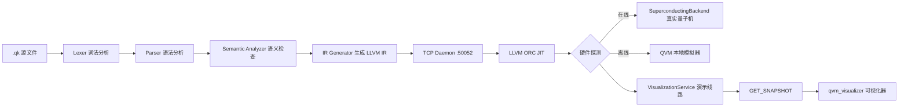

<<<<<<< HEAD
# Quark — 量子编程语言

[English](./README.en.md)

Quark（`.qk`）是一门面向「量子计算 + 神经接口 + 量子语言模型 + 量子机器人」的实验性编程语言。本仓库提供了完整的 **VSCode 语言支持扩展**、**LLVM ORC JIT 运行时**、**命令行工具链**、**Web 推理界面**、**Go 安装器**、**实时量子可视化器**、**VedaROS 量子机器人操作系统**与 **QbNS 量子脑网络**。

---

## ✨ 特性

| 特性 | 说明 |
| --- | --- |
| 量子编程 | 量子比特分配、量子对象、测量、Bell 态、量子寄存器（`Qubit` / `QObject` / `measure` / `DiracState` / `BellState` / `QuantumRegister`） |
| 量子硬件抽象 | 自动探测真实量子机（FPGA 超导 / 离子阱 / 中性原子后端），否则回退到本地 QVM 模拟器 |
| 量子语言模型 QLM | 变分量子电路训练、模型导出（`.qkm`）、文本 → 量子态编码与解码 |
| 脑机接口 BCI | `mind_read` / `mind_train` / `mind_feedback`，通过 QbNS Transducer 将神经信号编码为量子态 |
| QbNS 量子脑网络 | `Transducer`（神经→量子编码）、`Rmx`（分布式混合网络）、`qbw`（脑量子波 / 量子流 / 分布链接） |
| VedaROS 量子机器人 OS | 类 ROS 的量子分布式操作系统：QDDP 去中心化协议、类 rclcpp 客户端库、qk 自定义语言、坐标变换树、行为树导航、纠缠意识规划、硬件抽象 |
| 实时量子可视化 | `qvm_visualizer`：电路网格、态矢量、Bloch 球、量子对象、测量历史、性能指标六窗口实时观察 |
| JIT 执行 | 基于 LLVM ORC JIT 的即时编译与执行 |
| AOT 编译 | `qk compile` 将脚本编译为原生二进制（x32 / x64 / arm64） |
| `.mmi` 模块系统 | `mod` / `use` / `import` / `export` / `requires` 模块声明与导入导出，打包为 `.mmi` 模块（QKMM 格式）动态加载与调用 |
| Rust 风格类型系统 | `form` / `trait` / `impl` / `template` / `rank` 声明式类型、泛型与 trait 实现 |
| 量子门原语 | 内置 `x` `h` `rz` `cnot` `toffoli` `swap` `qft` `braid` 门与 `measure_x` / `measure_y` 测量 |
| HTTP 推理服务 | `qk serve` 提供 OpenAI 兼容的 `chat/completions`、`embeddings`、`models` 接口 |
| Web 聊天界面 | 基于 Vite + Tailwind + Dexie 的流式推理聊天界面 |
| 工具链管理 | Go 编写的 `quarkup` 安装器与版本代理 |
| quarkSE 编辑器 | 轻量 qk 桌面编辑器（Electron + CodeMirror），复用语言服务器编译管线，支持文件打开/保存/运行 |
| quarkRSP 仿真平台 | 量子机器人仿真平台：物理内核（QM/QVM）、Vulkan PBR 渲染、蓝图编辑、QCDRC 遥操作、量子 RL、脑意识控制 |
| quarkRSP Qt GUI | 基于 Qt 6 + QVulkanWindow 的桌面仿真界面：真 3D 视口、World Outliner / Details 面板、遥操作 / RL / 意识控制 |

---

## 📁 目录结构

```
quark-vscode/
├── client/                    VSCode 扩展客户端（LanguageClient）
├── server/                    语言服务器：lexer / parser / semantic / IR / mmi / CLI / HTTP API 路由
│   └── qk.cmd                 `qk` 命令行入口（Windows）
├── runtime/                   C++20 运行时：LLVM ORC JIT + 量子硬件抽象层（QHAL）
│   ├── src/                   入口与 C ABI 核心（main.cpp / runtime_api.cpp / QObject.hpp / QDataEncoder.hpp）
│   └── include/
│       ├── qhal/              量子硬件抽象层（QM / QVM / JIT / SandboxJIT / MMI / VisualizationService / 多种物理后端）
│       ├── qbNs/              量子脑网络 QbNS（Transducer / Rmx / qbw 脑量子波 / qbNSBridge）
│       ├── vedaRos/           量子机器人操作系统 VedaROS（core / bridge / algorithm / hardware / quantum）
│       ├── gui/               实时量子可视化器（protocol / components / windows / src）
│       ├── qlm/               量子语言模型 QLM
│       ├── qml/               量子机器学习原语（Layer / QKMFormat / Inference）
│       ├── numqk/             数值张量库 Numqk（Tensor / Autograd）
│       ├── stub/              桩实现（nabStub.hpp）
│       └── utils/             工具（FastPhaseRetrieval / Ga）
├── quarkSE/                   轻量 qk 桌面编辑器（Electron + CodeMirror，复用 server 编译管线）
│   ├── src/                   Electron 主进程 + 编译管线复用 + daemon 连接
│   └── renderer/              CodeMirror 编辑器 + 输出 Shell + 状态栏
├── quarkRSP/                  量子机器人仿真平台（C++20，作为 runtime 的新 target）
│   ├── include/               core / qpc / qpu / circuit / blueprint / pcg / render / editor / control / bridge / qcdrc
│   ├── src/                   入口、Vulkan 上下文、JIT host、stb_image 实现、RL demo
│   ├── gui/                   Qt 6 仿真平台 UI（qt 窗口 + simulation_host 仿真内核）
│   ├── shaders/               PBR 着色器（GLSL）
│   └── tests/                 单元测试（87 个用例 / 24 个套件）
├── quark-web-ui/              Web 推理聊天界面（Vite + Tailwind + Dexie）
├── installer/                 Go 工具链安装器 / 版本代理（quarkup）
├── scripts/                   构建 / 签名脚本（sign.ps1、deploy-wdac、Linux 构建安装）
├── examples/                  示例 `.qk` 程序
├── syntaxes/                  TextMate 语法高亮
├── vendor/                    第三方库（GLFW、Nuklear 等）
└── vcpkg/                     vcpkg 依赖管理
```

---

## ⚠️ 构建前必读

> **重要**：本仓库中的 `.vscode/*.json`、`runtime/.clangd` 与 `runtime/CMakeLists.txt` 包含作者本机的**绝对路径**（Kokkos、CUDA、LLVM、GLFW、编译器位置等）。**开发者必须根据自己的实际安装路径修改这些文件后，才能正确构建。** 请勿直接使用仓库中的硬编码路径。

需要修改的位置：

| 文件 | 需修改项 |
| --- | --- |
| `runtime/CMakeLists.txt` | `Kokkos_DIR`（第 58 行，`C:/Libraries/kokkos/lib/cmake/Kokkos`）、GLFW 库目录 `lib-vc2026`（第 48 行） |
| `quarkRSP/CMakeLists.txt` | `Qt6_DIR`（第 127 行，`C:/Qt/6.11.2/msvc2022_64/lib/cmake/Qt6`，仅构建 `quarkRSP_gui` 时需要） |
| `runtime/.clangd` | Kokkos / CUDA 的 `-I` include 路径（第 7-8 行） |
| `.vscode/c_cpp_properties.json` | `compilerPath`、Kokkos/CUDA/LLVM 的 `includePath` |
| `.vscode/settings.json` | `cmake.sourceDirectory`（工作区绝对路径） |

依赖的下载与编译方法详见 [🛠️ 依赖与构建](#-依赖与构建)。

---

## 🚀 快速开始

### 1. VSCode 扩展

```bash
npm install
npm run compile        # 编译 client 与 server（tsc -b）
```

在 VSCode 中按 `F5` 启动扩展调试，或通过 `vsce package` 打包安装。打开任意 `.qk` 文件即可获得语法高亮、自动补全与语义诊断。

- **运行脚本**：`Ctrl+Alt+N`（macOS：`Cmd+Alt+N`）或点击编辑器右上角 ▶ 按钮。

### 2. C++ 运行时

运行时依赖 **LLVM**、**Kokkos**、**Vulkan + GLFW + Nuklear**。完整依赖清单与编译方法见 [🛠️ 依赖与构建](#-依赖与构建)。

> ⚠️ 构建前请先按 [构建前必读](#-构建前必读) 修改硬编码路径，或通过命令行 `-D` 参数覆盖。

```bash
cd runtime
cmake -B build -S . -G "Ninja" \
  -DCMAKE_CXX_COMPILER="<你的 clang-cl / g++ / clang++ 路径>" \
  -DCMAKE_TOOLCHAIN_FILE="<你的 vcpkg 路径>/scripts/buildsystems/vcpkg.cmake" \
  -DLLVM_DIR="<你的 LLVM cmake 目录>" \
  -DKokkos_DIR="<你的 Kokkos 安装>/lib/cmake/Kokkos" \
  -DCUDAToolkit_ROOT="<你的 CUDA 安装目录>"
cmake --build build --config Release --parallel
```

构建产生以下目标：

| 目标 | 类型 | 说明 |
| --- | --- | --- |
| `quark_rt` | 共享库 | 量子核心（LLVM ORC JIT + QHAL + Kokkos），导出 C ABI（`RuntimeApi.h`） |
| `runtime` | 可执行 | 壳子：socket 守护进程（`--daemon` 监听 `localhost:50052`）+ stdin 交互，经 C ABI 调用 `quark_rt` |
| `qvm_visualizer` | 可执行 | 实时量子可视化器（Vulkan + GLFW + Nuklear） |
| `transmitter` | 可执行 | QLM 发射器 |
| `quarkRSP` | 可执行 | 量子机器人仿真平台主程序（物理内核 + Vulkan PBR 渲染 + 蓝图 + 遥操作） |
| `quarkRSP_rl_demo` | 可执行 | 量子 RL 端到端训练 demo（真实 QVM 后端） |
| `quarkRSP_tests` | 可执行 | quarkRSP 单元测试（87 个用例 / 24 个套件） |
| `quarkRSP_sim` | 静态库 | 仿真内核（物理 / 遥操作 / RL / QVM / 意识，需 Qt 6） |
| `quarkRSP_gui` | 可执行 | Qt 6 桌面仿真界面（需 Qt 6，可选） |

- **前台模式（stdin/stdout）**：`./runtime`
- **守护进程模式**：`./runtime --daemon`（供 CLI、API 服务与可视化器使用）

### 3. 命令行工具

`server/qk.cmd` 将 `qk` 映射到编译后的 `server/out/cli.js`：

```bash
qk run <script.qk>                                  # 运行脚本
qk compile <x32|x64|arm64> <-e|-m> <script.qk>      # 编译为原生二进制（-e 可执行 / -m 混合库）
qk serve <model.qkm> [--port <port>]                # 启动 HTTP 推理服务（默认 9080）
```

### 4. 实时量子可视化器

可视化器通过 socket 连接守护进程（`localhost:50052`），实时读取真实 QVM 状态：

```bash
# 终端 1：启动守护进程（内部运行 5-qubit 演示线路）
./runtime --daemon

# 终端 2：启动可视化器
./qvm_visualizer
```

六窗口界面详见 [🖥️ QVM 可视化器](#-qvm-可视化器)。

### 5. Web 推理界面

```bash
cd quark-web-ui
npm install
npm run dev          # 开发模式
npm run build        # 生产构建
```

界面默认连接 `http://localhost:9080/v1/chat/completions`，需先通过 `qk serve` 启动推理服务。

### 6. quarkSE 编辑器

类似 Python IDLE 的轻量 qk 桌面编辑器，复用语言服务器的编译管线：

```bash
cd quarkSE
npm install
npm start          # 编译并启动 Electron 编辑器
```

运行脚本前请先启动守护进程 `./runtime --daemon`。编辑器支持打开/保存 `.qk` 文件、语法高亮（CodeMirror）、实时诊断与一键运行。

### 7. quarkRSP 仿真平台

量子机器人仿真平台作为 runtime 的新 target 构建（需先完成 [构建前必读](#-构建前必读) 的路径配置）：

```bash
cd runtime
cmake --build build --target quarkRSP            # 仿真平台主程序
cmake --build build --target quarkRSP_rl_demo    # 量子 RL 端到端 demo
cmake --build build --target quarkRSP_tests      # 单元测试
ctest -R quarkRSP_tests                          # 运行测试（87 个用例 / 24 个套件）
```

详细架构见 [🤖 quarkRSP 仿真平台](#-quarkrsp-仿真平台)。

---

## 🧩 语言参考

### 类型系统

`int8` `int16` `int32` `int64` `uint8` `uint16` `uint32` `uint64` `float` `double` `string` `char` `Qubit` `QObject` `QModel`（另有 `auto` / `let` 类型推导）

### 控制流

`let` `auto` `int` `new` `return` `if` `else` `while` `for`

### 内置函数

| 函数 | 签名 | 返回 | 说明 |
| --- | --- | --- | --- |
| `alloc` | `alloc()` | `Qubit` | 分配一个量子比特 |
| `measure` | `measure(<Qubit>)` | `int` | 测量量子比特并坍缩 |
| 量子门 | `x` `h` `rz` `cnot` `toffoli` `swap` `qft` `braid` | — | 内置量子门操作 |
| 量子测量 | `measure_x` / `measure_y` | `int` | X / Y 基测量 |
| `encode_text` | `encode_text(string)` | `QObject` | 文本编码为量子态 |
| `encode_image` | `encode_image(string)` | `QObject` | 图像编码为量子态 |
| `qk_encode_string` | `qk_encode_string(string)` | `QObject` | 字符串 → 量子对象 |
| `qk_decode_string` | `qk_decode_string(QObject)` | `string` | 量子对象 → 字符串 |
| `qlm_load` | `qlm_load(string)` | `QModel` | 加载 QLM 模型（`.qkm`） |
| `qlm_forward` | `qlm_forward(QModel, QObject)` | `void` | QLM 前向推理 |
| `qlm_invoke` | `qlm_invoke(QObject, int, double)` | `QModel` | 训练变分量子电路 |
| `mind_read` | `mind_read(string)` | `QObject` | 读取脑信号并编码为量子态（`stream/spike/lfp/eeg/sensor`） |
| `mind_train` | `mind_train(QObject, int, double)` | `void` | 用脑信号训练 QLM 并导出 |
| `mind_feedback` | `mind_feedback(QObject)` | `void` | 测量脑状态，闭合神经反馈闭环 |
| `veda_qlm_train` | `veda_qlm_train(QObject, int, double)` | `void` | 调用 VedaROS QLM 训练 |

### 内置类

`DiracState` `BellState` `QuantumRegister`（通过 `new` 实例化，支持 `.measure()` 等方法成员访问）

### 模块系统（`.mmi`）

支持模块的声明与导入导出，可打包为 `.mmi` 模块（QKMM 格式）供运行时动态加载与调用：

```qk
// 定义并导出模块
mod math {
    pub int32 add(int32 a, int32 b) {
        return a + b;
    }
    export int32 square(int32 x) {
        return x * x;
    }
}
```

```qk
// 导入 .mmi 模块并调用
import math from "./math.mmi";
requires io.network;      // 声明所需权限
let result = math.add(1, 2);
```

- 关键字：`mod`（模块）、`use`（路径导入）、`pub`（公开）、`import` + `from`（导入 `.mmi`）、`export`（导出）、`requires`（权限声明）
- `.mmi` 头信息（`name` / `version` / `exports` / `permissions` / `imports`）由语言服务器（`server/src/mmi.ts`）打包，运行时（`qhal/MMI.hpp`）通过 C ABI（`RuntimeApi.h` 的 `quark_runtime_*_mmi`）加载与调用

### 类型定义（form / trait / impl）

声明式类型系统：

| 关键字 | 说明 |
| --- | --- |
| `form` | 定义数据结构，支持继承（`inherits`）与 `rank` 秩 |
| `trait` | 定义可共享的行为接口 |
| `impl` | 为类型实现 trait（`impl <trait> for <type>`） |
| `template` | 泛型声明 |
| `self` | 方法接收者（`self` / `&self`） |

### 入口函数

每个程序需定义 `quark_main`：

```qk
int32 quark_main() {
    return 0;
}
```

### 示例

```qk
// 示例 1：Bell 态统计（examples/FivemBell.qk）
int32 quark_main() {
    int32 iterations = 50000;
    int32 total_ones = 0;
    auto massive_reg = new QuantumRegister(15);

    int32 count = 0;
    while (count < iterations) {
        auto bell_pair = new BellState();
        total_ones = total_ones + bell_pair.measure();
        count = count + 1;
    }
    return total_ones;
}
```

```qk
// 示例 2：脑控编程（examples/mind_controlled.qk）
let brain_state = mind_read("eeg");     // 脑电 → 量子态
let bits = brain_state.measure;         // 意念驱动的测量
mind_train(brain_state, 200, 0.01);     // 大脑训练 QLM
mind_feedback(brain_state);             // 神经反馈
```

```qk
// 示例 3：VedaROS QLM 训练（examples/veda_qlm.qk）
let brain = mind_read("eeg");           // 脑电 → 量子态
let model = qlm_invoke(brain, 10, 0.01); // QLM 调用
model.export("brain_model.qkm");        // 导出模型
veda_qlm_train(brain, 200, 0.01);       // VedaROS QLM 训练
```

---

## ⚙️ 架构



**编译管线**：`Lexer → Parser → SemanticAnalyzer → IRGenerator → LLVM IR → JIT Daemon (port 50052) → 执行`

**VSCode 运行流程**：编辑器 ▶ 按钮 → `quark/runCode` 通知 → 语言服务器生成 LLVM IR → `spawn('quark')` 转发至守护进程执行 → 输出回显至「Quark Console」。

**实时可视化数据流**：守护进程内的 `VisualizationService` 在真实 `qhal::QVM` 上演化 5-qubit 演示线路，将态矢量 / 门事件 / 测量结果 / 对象列表序列化为快照，经 `GET_SNAPSHOT` 命令提供给 `qvm_visualizer`。

---

## 🎮 quarkRSP — 量子机器人仿真平台

`quarkRSP/` 是一个量子机器人仿真平台（C++20，作为 runtime 的新 target），复用 `qhal`（QM/QVM）、`vedaRos`、`numqk`。

| 子系统 | 位置 | 说明 |
| --- | --- | --- |
| 物理内核 qpc | `include/qpc/` | 刚体动力学 + 碰撞检测 + 约束求解（参考 AlphaPHY），量子接口委托 QM/QVM |
| Vulkan 渲染 | `include/render/` | 3D 渲染 + PBR（Cook-Torrance）+ 纹理采样 + OBJ/glTF/glb 加载 + 内置 PNG/JPEG 解码 |
| 蓝图编辑 | `include/blueprint/` | 行为树 + Material/Substrate 节点图 + Nuklear 可视化编辑器 |
| QPU/QPL 设计 | `include/qpu/` | 量子处理器与量子编程层设计器 |
| 机器人电路 | `include/circuit/` | 机器人电路设计与连接 |
| PCG 框架 | `include/pcg/` | 种子驱动程序化内容生成 |
| 控制与 RL | `include/control/` | 量子 RL Agent + 端到端训练 pipeline + 真实物理环境 + 脑意识介入 + qbNs 桥接 |
| QCDRC 遥操作 | `include/qcdrc/` | RGB 相机采样 + 全身动捕 + IK/动作映射 + 行为克隆 + 真实设备接入（OpenCV/ExternalMocap） |

统一入口：`#include "quarkRSP.hpp"`。

### 🖥️ quarkRSP Qt GUI

除命令行主程序外，`quarkRSP_gui` 提供了一个基于 **Qt 6 Widgets + QVulkanWindow** 的桌面仿真界面（需安装 Qt 6，详见 [🛠️ 依赖与构建](#-依赖与构建)）：

| 组件 | 位置 | 说明 |
| --- | --- | --- |
| 仿真内核 | `gui/src/simulation_host.hpp/.cpp` | `SimulationHost`：物理步进 / 遥操作 / RL 训练 / QVM / 意识与脑机桥 |
| Qt 主窗口 | `gui/qt/main_window.cpp` | QTabWidget 面板布局 |
| Vulkan 视口 | `gui/qt/vulkan_viewport.cpp` | QVulkanWindow 真 3D 渲染视口 |
| 面板 | `gui/qt/panels.cpp` | World Outliner / Details 等面板与实体选中联动 |

构建时通过 `windeployqt` 自动部署 Qt 运行时 DLL，并在构建后自动代码签名（见 [🔐 代码签名与 WDAC](#-代码签名与-wdac)）。

---

## ✍️ quarkSE — 轻量 qk 编辑器

`quarkSE/` 是一个轻量 qk 桌面编辑器（Electron + CodeMirror 6）。

- **复用编译管线**：通过 `rootDir: ".."` 直接引用 `server/src` 的 lexer / parser / semantic / ir，零代码重复
- **文件操作**：打开 / 保存 `.qk` 文件（Electron 原生对话框）
- **运行**：生成 LLVM IR → 连接 daemon（`localhost:50052`）执行，输出回显至 Shell 窗口
- **编辑器**：CodeMirror 6 语法高亮 + 实时诊断 + dirty 状态跟踪

---

## 🤖 VedaROS — 量子机器人操作系统

`runtime/include/vedaRos/` 实现了一个深度集成量子计算的分布式机器人操作系统。它以 **QDDP（Quantum-classical Decentralized Distributed Protocol，量子-经典去中心化协议）** 取代 DDS，支持与 QbNS 脑量子波通信，并提供类 rclcpp 的客户端库。

| 模块 | 文件 | 说明 |
| --- | --- | --- |
| 类型系统 | `core/types.hpp` | 类型安全序列化、量子-经典双通道负载 |
| 通信协议 | `core/quantum_transport.hpp` | QDDP 去中心化节点通信（`Endpoint` / `QMessage`） |
| 客户端库 | `core/node.hpp` | 类 rclcpp 的 `Node`：发布/订阅/服务/动作/执行器 |
| 自定义语言 | `core/qk_lang.hpp` | qk 语言定义意识/思想/决策/消息/服务/动作；编译期为真实量子设备生成门序列、为 QVM 生成 C++ |
| 脑波桥接 | `bridge/brain_wave_bridge.hpp` | 将 QbNS 脑量子波桥接至 VedaROS 节点网络 |
| 坐标变换树 | `algorithm/tf_tree.hpp` | 创新量子-经典坐标变换树 |
| 行为树导航 | `algorithm/behavior_tree.hpp` | 多并行行为树导航路径规划 |
| 纠缠规划 | `algorithm/entangled_planner.hpp` | 完全纠缠意识的运动规划与操作 |
| 硬件抽象 | `hardware/hardware_abstraction.hpp` | 硬件抽象层 + 固定频率控制循环 |
| 电机/传感器 | `hardware/actuator_sensor.hpp` | 统一电机/传感器接口（增量编码器采样） |
| QLM 集成 | `quantum/qlm.hpp` | VedaROS QLM 封装 + `qk_veda_qlm_train` ABI |

统一入口：`#include "vedaRos/vedaRos.hpp"`。

---

## 🧠 QbNS — 量子脑网络

`runtime/include/qbNs/` 实现面向脑机接口（BMI）的量子混合架构，支持四种模态（非侵入式 / 侵入式 / 无线 / 量子传感器）。

| 组件 | 文件 | 说明 |
| --- | --- | --- |
| 神经编码器 | `Transducer.hpp` | 将神经信号（`NeuralStream` / `SpikeTrain` / `LFP` / `EEGSpectrum` / `QuantumSensorReading`）编码为量子态 |
| 分布式网络 | `rmx.hpp` | `Rmx`：脑节点 / QC 节点注册、自适应路由、实时控制回路 |
| 脑量子波 | `qbw.hpp` | `BrainQuantumWave`：检索量子对象构造量子流，建立脑量子波分布链接 |
| 顶层接口 | `qbNs.hpp` | `QbNS`：统一混合架构表层 |
| C 桥接 | `qbNSBridge.hpp` | `qk_mind_read` / `qk_mind_train` / `qk_mind_feedback` 的 ABI 导出 |

---

## 🖥️ QVM 可视化器

`qvm_visualizer` 是一个基于 Vulkan + GLFW + Nuklear 的实时量子可视化应用，通过 socket 读取守护进程的真实量子状态。

六个观察窗口：

| 窗口 | 观察内容 |
| --- | --- |
| Quantum Circuit | 量子线路 / 门序列 |
| State Vector | 各基态振幅（实/虚）+ 概率柱状图（≤8 qubit 全量展示） |
| Bloch Sphere | 单比特 Bloch 球投影（θ/φ） |
| Quantum Objects | 活量子对象列表（类型 + qubit id） |
| Measurement History | 测量结果时间序列 / 分布 |
| Metrics | FPS、帧时间、连接状态、generation、present 模式 |

**性能优化**：多帧在飞（per-frame `VkFence` 替代 `vkQueueWaitIdle`）、`VK_PRESENT_MODE_MAILBOX` 低延迟呈现、快照代数计数避免冗余拷贝、delta-time 节流。

**共享协议**：`runtime/include/gui/protocol.hpp` 定义了 daemon 与可视化器之间零依赖的 `StateSnapshot` 行协议（`GET_SNAPSHOT` → `END_SNAPSHOT`）。

---

## 🔌 推理服务 API

`qk serve <model.qkm>` 提供 OpenAI 兼容接口：

| 方法 | 路径 | 说明 |
| --- | --- | --- |
| `GET` | `/v1/models` | 模型列表 |
| `POST` | `/v1/chat/completions` | 对话补全（支持 `stream: true` SSE） |
| `POST` | `/v1/embeddings` | 文本嵌入 |

---

## 🔐 代码签名与 WDAC

`scripts/` 提供 Windows 下的代码签名与 WDAC（Windows Defender Application Control）部署脚本，用于在启用 WDAC 的主机上放行自行编译的可执行文件：

| 文件 | 说明 |
| --- | --- |
| `scripts/sign.ps1` | 使用自签名证书（`scripts/certs/quark-codesign.pfx`）调用 `signtool` 对目标签名 |
| `scripts/deploy-wdac.ps1` | 部署 WDAC 补充策略（`scripts/wdac/supplemental.cip`），需管理员权限 |
| `scripts/deploy-wdac-fix.ps1` | 修复脚本（配合 WDAC 策略调整） |
| `scripts/build-linux.sh` / `install-linux.sh` | Linux 下的构建与安装脚本 |

`quarkRSP_gui` 在 `windeployqt` 部署 Qt 运行时后会自动执行 `sign.ps1`（`quarkRSP/CMakeLists.txt` 已配置）。

> 证书与 WDAC 策略文件仅用于本机开发环境的签名/放行，请勿将私钥（`.pfx`）纳入分发。

---

## 🛠️ 依赖与构建

### 依赖清单

| 依赖 | 用途 | 必需 | 获取方式 |
| --- | --- | --- | --- |
| LLVM | 运行时（JIT / AOT） | ✅ 必需 | vcpkg / MSYS2 / 官方预编译二进制 |
| Kokkos | 运行时（数值/张量后端） | ✅ 必需 | 源码编译（可选 CUDA 后端） |
| CUDA Toolkit | Kokkos 的 GPU 后端 | ⚠️ 可选 | NVIDIA 官方安装 |
| Vulkan SDK | `qvm_visualizer` 可视化器 | ⚠️ 仅可视化器 | LunarG 官方安装 |
| GLFW + Nuklear | 可视化器 | ⚠️ 仅可视化器 | 已在 `vendor/` 提供 |
| Node.js + TypeScript | VSCode 扩展 / 语言服务器 | ✅ 必需 | 官网安装 |
| Electron + CodeMirror + esbuild | `quarkSE` 编辑器 | ⚠️ 仅编辑器 | `npm install`（quarkSE 目录） |
| OpenCV | `quarkRSP` 真实相机（可选） | ⚠️ 可选 | 官方安装 + `QUARKRSP_USE_OPENCV` |
| Qt 6 | `quarkRSP_gui` 桌面仿真界面 | ⚠️ 可选（仅 GUI） | 官方安装 + `Qt6_DIR` 指向 Qt 安装 |
| Go | `installer/`（quarkup） | ⚠️ 仅安装器 | 官网安装 |

### LLVM（必需）

任选其一：

```bash
# 方式 A：vcpkg
vcpkg install llvm

# 方式 B：MSYS2（UCRT64）
pacman -S mingw-w64-ucrt-x86_64-llvm

# 方式 C：LLVM 官方预编译二进制
# 下载 https://github.com/llvm/llvm-project/releases 的 Windows 安装包
```

配置后需确保 `find_package(LLVM REQUIRED CONFIG)` 能找到 `LLVMConfig.cmake`（通过 `LLVM_DIR` 环境变量或 CMake 参数传入）。

### Kokkos（必需）

从源码编译（默认启用 CPU 线程后端；如有 NVIDIA GPU 可同时启用 CUDA 后端）：

```bash
git clone https://github.com/kokkos/kokkos.git
cd kokkos
cmake -B build -S . -DCMAKE_BUILD_TYPE=Release \
  -DKokkos_ENABLE_THREADS=ON \
  -DKokkos_ENABLE_CUDA=ON \                          # 可选：无 GPU 时去掉此行
  -DCMAKE_INSTALL_PREFIX=C:/Libraries/kokkos        # 改成你的安装路径
cmake --build build --target install
```

> 编译完成后，将 `CMakeLists.txt` 中的 `Kokkos_DIR` 指向 `<安装路径>/lib/cmake/Kokkos`，并将 include 路径改为 `<安装路径>/include`。

### CUDA Toolkit（可选）

仅当启用 Kokkos 的 CUDA 后端时需要。从 [NVIDIA CUDA Toolkit](https://developer.nvidia.com/cuda-toolkit) 下载安装，然后：

- 将 `CUDAToolkit_ROOT` 指向安装目录（如 `C:/Program Files/NVIDIA GPU Computing Toolkit/CUDA/v12.9`）
- 同步更新 `.clangd` 与 `c_cpp_properties.json` 中的 CUDA include 路径

### Vulkan SDK（仅可视化器）

从 [LunarG Vulkan SDK](https://vulkan.lunarg.com/) 下载安装。`find_package(Vulkan REQUIRED)` 会通过 `VULKAN_SDK` 环境变量定位。

### Qt 6（仅 quarkRSP_gui，可选）

从 [Qt 官网](https://www.qt.io/download) 安装 Qt 6（含 Widgets / Gui 组件），然后将 `quarkRSP/CMakeLists.txt` 中的 `Qt6_DIR` 指向 `<Qt 安装目录>/lib/cmake/Qt6`（本仓库示例为 `C:/Qt/6.11.2/msvc2022_64`）。未安装 Qt 时 `quarkRSP_gui` 会自动跳过，其余目标不受影响。

### 配置与编译

```bash
cd runtime
cmake -B build -S . -G "Ninja" \
  -DCMAKE_CXX_COMPILER="<你的 clang-cl / g++ / clang++ 路径>" \
  -DCMAKE_TOOLCHAIN_FILE="<你的 vcpkg 路径>/scripts/buildsystems/vcpkg.cmake" \
  -DLLVM_DIR="<你的 LLVM cmake 目录>" \
  -DKokkos_DIR="<你的 Kokkos 安装>/lib/cmake/Kokkos" \
  -DCUDAToolkit_ROOT="<你的 CUDA 安装目录>"
cmake --build build --config Release --parallel
```

> 以上 `-D` 参数仅为示例，请替换为你本机的真实路径。若通过命令行 `-D` 传参，可覆盖 `CMakeLists.txt` 中的硬编码值，无需改动源码文件。

### VSCode 扩展

- Node.js、npm
- `vscode-languageclient` / `vscode-languageserver` / `vscode-languageserver-textdocument`
- TypeScript

```bash
npm install
npm run compile
```

### 安装器

- Go 1.26+（`golang.org/x/sys`）

---

## 📄 License

本项目以 [MIT 许可证](LICENSE) 开源，版权所有 © 2026 QuarkProject。

> 项目中引用的第三方库遵循其各自的许可证，详见 [THIRD_PARTY_NOTICES.md](THIRD_PARTY_NOTICES.md)。
=======
# Quark — 量子编程语言

[English](./README.en.md)

Quark（`.qk`）是一门面向「量子计算 + 神经接口 + 量子语言模型 + 量子机器人」的实验性编程语言。本仓库提供了完整的 **VSCode 语言支持扩展**、**LLVM ORC JIT 运行时**、**命令行工具链**、**Web 推理界面**、**Go 安装器**、**实时量子可视化器**、**VedaROS 量子机器人操作系统**与 **QbNS 量子脑网络**。

---

## ✨ 特性

| 特性 | 说明 |
| --- | --- |
| 量子编程 | 量子比特分配、量子对象、测量、Bell 态、量子寄存器（`Qubit` / `QObject` / `measure` / `DiracState` / `BellState` / `QuantumRegister`） |
| 量子硬件抽象 | 自动探测真实量子机（FPGA 超导 / 离子阱 / 中性原子后端），否则回退到本地 QVM 模拟器 |
| 量子语言模型 QLM | 变分量子电路训练、模型导出（`.qkm`）、文本 → 量子态编码与解码 |
| 脑机接口 BCI | `mind_read` / `mind_train` / `mind_feedback`，通过 QbNS Transducer 将神经信号编码为量子态 |
| QbNS 量子脑网络 | `Transducer`（神经→量子编码）、`Rmx`（分布式混合网络）、`qbw`（脑量子波 / 量子流 / 分布链接） |
| VedaROS 量子机器人 OS | 类 ROS 的量子分布式操作系统：QDDP 去中心化协议、类 rclcpp 客户端库、qk 自定义语言、坐标变换树、行为树导航、纠缠意识规划、硬件抽象 |
| 实时量子可视化 | `qvm_visualizer`：电路网格、态矢量、Bloch 球、量子对象、测量历史、性能指标六窗口实时观察 |
| JIT 执行 | 基于 LLVM ORC JIT 的即时编译与执行 |
| AOT 编译 | `qk compile` 将脚本编译为原生二进制（x32 / x64 / arm64） |
| `.mmi` 模块系统 | `mod` / `use` / `import` / `export` / `requires` 模块声明与导入导出，打包为 `.mmi` 模块（QKMM 格式）动态加载与调用 |
| Rust 风格类型系统 | `form` / `trait` / `impl` / `template` / `rank` 声明式类型、泛型与 trait 实现 |
| 量子门原语 | 内置 `x` `h` `rz` `cnot` `toffoli` `swap` `qft` `braid` 门与 `measure_x` / `measure_y` 测量 |
| HTTP 推理服务 | `qk serve` 提供 OpenAI 兼容的 `chat/completions`、`embeddings`、`models` 接口 |
| Web 聊天界面 | 基于 Vite + Tailwind + Dexie 的流式推理聊天界面 |
| 工具链管理 | Go 编写的 `quarkup` 安装器与版本代理 |
| quarkSE 编辑器 | 轻量 qk 桌面编辑器（Electron + CodeMirror），复用语言服务器编译管线，支持文件打开/保存/运行 |
| quarkRSP 仿真平台 | 量子机器人仿真平台：物理内核（QM/QVM）、Vulkan PBR 渲染、蓝图编辑、QCDRC 遥操作、量子 RL、脑意识控制 |
| quarkRSP Qt GUI | 基于 Qt 6 + QVulkanWindow 的桌面仿真界面：真 3D 视口、World Outliner / Details 面板、遥操作 / RL / 意识控制 |
| 义肢 / 义眼 | 脑意识控制的义肢（`ProstheticLimb`，EMG 肌电）与义眼（`BionicEye`，EEG 脑电），辅以量子强化学习（复用 `QuantumRLAgent` + `ConsciousnessController`），支持物理义肢驱动与义眼相机 |

---

## 📁 目录结构

```
quark-vscode/
├── client/                    VSCode 扩展客户端（LanguageClient）
├── server/                    语言服务器：lexer / parser / semantic / IR / mmi / CLI / HTTP API 路由
│   └── qk.cmd                 `qk` 命令行入口（Windows）
├── runtime/                   C++20 运行时：LLVM ORC JIT + 量子硬件抽象层（QHAL）
│   ├── src/                   入口与 C ABI 核心（main.cpp / runtime_api.cpp / QObject.hpp / QDataEncoder.hpp）
│   └── include/
│       ├── qhal/              量子硬件抽象层（QM / QVM / JIT / SandboxJIT / MMI / VisualizationService / 多种物理后端）
│       ├── qbNs/              量子脑网络 QbNS（Transducer / Rmx / qbw 脑量子波 / qbNSBridge）
│       ├── vedaRos/           量子机器人操作系统 VedaROS（core / bridge / algorithm / hardware / quantum）
│       ├── gui/               实时量子可视化器（protocol / components / windows / src）
│       ├── qlm/               量子语言模型 QLM
│       ├── qml/               量子机器学习原语（Layer / QKMFormat / Inference）
│       ├── numqk/             数值张量库 Numqk（Tensor / Autograd / SoftLogic）
│       ├── spacetime/         时空微分几何求解器（Foliation / Integrators / KaluzaKlein / NeuralField / SpectralEEG / TachyonField 等）
│       ├── verify/            静态验证器（Verifier / SmtLibEmitter / IntervalAbstract）
│       ├── stub/              桩实现（nabStub.hpp）
│       └── utils/             工具（FastPhaseRetrieval / Ga）
├── quarkSE/                   轻量 qk 桌面编辑器（Electron + CodeMirror，复用 server 编译管线）
│   ├── src/                   Electron 主进程 + 编译管线复用 + daemon 连接
│   └── renderer/              CodeMirror 编辑器 + 输出 Shell + 状态栏
├── quarkRSP/                  量子机器人仿真平台（C++20，作为 runtime 的新 target）
│   ├── include/               core / qpc / qpu / circuit / blueprint / pcg / render / editor / control / bridge / qcdrc
│   ├── src/                   入口、Vulkan 上下文、JIT host、stb_image 实现、RL demo
│   ├── gui/                   Qt 6 仿真平台 UI（qt 窗口 + simulation_host 仿真内核）
│   ├── shaders/               PBR 着色器（GLSL）
│   └── tests/                 单元测试（87 个用例 / 24 个套件）
├── quark-web-ui/              Web 推理聊天界面（Vite + Tailwind + Dexie）
├── installer/                 Go 工具链安装器 / 版本代理（quarkup）
├── scripts/                   构建 / 签名脚本（sign.ps1、deploy-wdac、Linux 构建安装）
├── examples/                  示例 `.qk` 程序
├── syntaxes/                  TextMate 语法高亮
├── vendor/                    第三方库（GLFW、Nuklear 等）
└── vcpkg/                     vcpkg 依赖管理
```

---

## ⚠️ 构建前必读

> **重要**：本仓库中的 `.vscode/*.json`、`runtime/.clangd` 与 `runtime/CMakeLists.txt` 包含作者本机的**绝对路径**（Kokkos、CUDA、LLVM、GLFW、编译器位置等）。**开发者必须根据自己的实际安装路径修改这些文件后，才能正确构建。** 请勿直接使用仓库中的硬编码路径。

需要修改的位置：

| 文件 | 需修改项 |
| --- | --- |
| `runtime/CMakeLists.txt` | `Kokkos_DIR`（第 58 行，`C:/Libraries/kokkos/lib/cmake/Kokkos`）、GLFW 库目录 `lib-vc2026`（第 48 行） |
| `quarkRSP/CMakeLists.txt` | `Qt6_DIR`（第 127 行，`C:/Qt/6.11.2/msvc2022_64/lib/cmake/Qt6`，仅构建 `quarkRSP_gui` 时需要） |
| `runtime/.clangd` | Kokkos / CUDA 的 `-I` include 路径（第 7-8 行） |
| `.vscode/c_cpp_properties.json` | `compilerPath`、Kokkos/CUDA/LLVM 的 `includePath` |
| `.vscode/settings.json` | `cmake.sourceDirectory`（工作区绝对路径） |

依赖的下载与编译方法详见 [🛠️ 依赖与构建](#-依赖与构建)。

---

## 🚀 快速开始

### 1. VSCode 扩展

```bash
npm install
npm run compile        # 编译 client 与 server（tsc -b）
```

在 VSCode 中按 `F5` 启动扩展调试，或通过 `vsce package` 打包安装。打开任意 `.qk` 文件即可获得语法高亮、自动补全与语义诊断。

- **运行脚本**：`Ctrl+Alt+N`（macOS：`Cmd+Alt+N`）或点击编辑器右上角 ▶ 按钮。

### 2. C++ 运行时

运行时依赖 **LLVM**、**Kokkos**、**Vulkan + GLFW + Nuklear**。完整依赖清单与编译方法见 [🛠️ 依赖与构建](#-依赖与构建)。

> ⚠️ 构建前请先按 [构建前必读](#-构建前必读) 修改硬编码路径，或通过命令行 `-D` 参数覆盖。

```bash
cd runtime
cmake -B build -S . -G "Ninja" \
  -DCMAKE_CXX_COMPILER="<你的 clang-cl / g++ / clang++ 路径>" \
  -DCMAKE_TOOLCHAIN_FILE="<你的 vcpkg 路径>/scripts/buildsystems/vcpkg.cmake" \
  -DLLVM_DIR="<你的 LLVM cmake 目录>" \
  -DKokkos_DIR="<你的 Kokkos 安装>/lib/cmake/Kokkos" \
  -DCUDAToolkit_ROOT="<你的 CUDA 安装目录>"
cmake --build build --config Release --parallel
```

构建产生以下目标：

| 目标 | 类型 | 说明 |
| --- | --- | --- |
| `quark_rt` | 共享库 | 量子核心（LLVM ORC JIT + QHAL + Kokkos），导出 C ABI（`RuntimeApi.h`） |
| `runtime` | 可执行 | 壳子：socket 守护进程（`--daemon` 监听 `localhost:50052`）+ stdin 交互，经 C ABI 调用 `quark_rt` |
| `qvm_visualizer` | 可执行 | 实时量子可视化器（Vulkan + GLFW + Nuklear） |
| `transmitter` | 可执行 | QLM 发射器 |
| `quarkRSP` | 可执行 | 量子机器人仿真平台主程序（物理内核 + Vulkan PBR 渲染 + 蓝图 + 遥操作） |
| `quarkRSP_rl_demo` | 可执行 | 量子 RL 端到端训练 demo（真实 QVM 后端） |
| `quarkRSP_tests` | 可执行 | quarkRSP 单元测试（87 个用例 / 24 个套件） |
| `quarkRSP_sim` | 静态库 | 仿真内核（物理 / 遥操作 / RL / QVM / 意识，需 Qt 6） |
| `quarkRSP_gui` | 可执行 | Qt 6 桌面仿真界面（需 Qt 6，可选） |

- **前台模式（stdin/stdout）**：`./runtime`
- **守护进程模式**：`./runtime --daemon`（供 CLI、API 服务与可视化器使用）

### 3. 命令行工具

`server/qk.cmd` 将 `qk` 映射到编译后的 `server/out/cli.js`：

```bash
qk run <script.qk>                                  # 运行脚本
qk ir <script.qk>                                   # 仅输出 LLVM IR 到 stdout（不连接 daemon）
qk compile <x32|x64|arm64> <-e|-m> <script.qk>      # 编译为原生二进制（-e 可执行 / -m 混合库）
qk verify <script.qk>                               # 静态验证契约（requires/ensures/invariant）
qk verify <script.qk> --smt [out.smt2]              # 导出 SMT-LIB 供外部求解器（Z3/cvc5）判定
qk serve <model.qkm> [--port <port>]                # 启动 HTTP 推理服务（默认 9080）
```

### 4. 实时量子可视化器

可视化器通过 socket 连接守护进程（`localhost:50052`），实时读取真实 QVM 状态：

```bash
# 终端 1：启动守护进程（内部运行 5-qubit 演示线路）
./runtime --daemon

# 终端 2：启动可视化器
./qvm_visualizer
```

六窗口界面详见 [🖥️ QVM 可视化器](#-qvm-可视化器)。

### 5. Web 推理界面

```bash
cd quark-web-ui
npm install
npm run dev          # 开发模式
npm run build        # 生产构建
```

界面默认连接 `http://localhost:9080/v1/chat/completions`，需先通过 `qk serve` 启动推理服务。

### 6. quarkSE 编辑器

类似 Python IDLE 的轻量 qk 桌面编辑器，复用语言服务器的编译管线：

```bash
cd quarkSE
npm install
npm start          # 编译并启动 Electron 编辑器
```

运行脚本前请先启动守护进程 `./runtime --daemon`。编辑器支持打开/保存 `.qk` 文件、语法高亮（CodeMirror）、实时诊断与一键运行。

### 7. quarkRSP 仿真平台

量子机器人仿真平台作为 runtime 的新 target 构建（需先完成 [构建前必读](#-构建前必读) 的路径配置）：

```bash
cd runtime
cmake --build build --target quarkRSP            # 仿真平台主程序
cmake --build build --target quarkRSP_rl_demo    # 量子 RL 端到端 demo
cmake --build build --target quarkRSP_tests      # 单元测试
ctest -R quarkRSP_tests                          # 运行测试（87 个用例 / 24 个套件）
```

详细架构见 [🤖 quarkRSP 仿真平台](#-quarkrsp-仿真平台)。

---

## 🧩 语言参考

### 类型系统

`int8` `int16` `int32` `int64` `uint8` `uint16` `uint32` `uint64` `float` `double` `string` `char` `Qubit` `QObject` `QModel`（另有 `auto` / `let` 类型推导）

### 控制流

`let` `auto` `int` `new` `return` `if` `else` `while` `for`

### 内置函数

| 函数 | 签名 | 返回 | 说明 |
| --- | --- | --- | --- |
| `alloc` | `alloc()` | `Qubit` | 分配一个量子比特 |
| `measure` | `measure(<Qubit>)` | `int` | 测量量子比特并坍缩 |
| 量子门 | `x` `h` `rz` `cnot` `toffoli` `swap` `qft` `braid` | — | 内置量子门操作 |
| 量子测量 | `measure_x` / `measure_y` | `int` | X / Y 基测量 |
| `encode_text` | `encode_text(string)` | `QObject` | 文本编码为量子态 |
| `encode_image` | `encode_image(string)` | `QObject` | 图像编码为量子态 |
| `qk_encode_string` | `qk_encode_string(string)` | `QObject` | 字符串 → 量子对象 |
| `qk_decode_string` | `qk_decode_string(QObject)` | `string` | 量子对象 → 字符串 |
| `qlm_load` | `qlm_load(string)` | `QModel` | 加载 QLM 模型（`.qkm`） |
| `qlm_forward` | `qlm_forward(QModel, QObject)` | `void` | QLM 前向推理 |
| `qlm_invoke` | `qlm_invoke(QObject, int, double)` | `QModel` | 训练变分量子电路 |
| `mind_read` | `mind_read(string)` | `QObject` | 读取脑信号并编码为量子态（`stream/spike/lfp/eeg/sensor`） |
| `mind_train` | `mind_train(QObject, int, double)` | `void` | 用脑信号训练 QLM 并导出 |
| `mind_feedback` | `mind_feedback(QObject)` | `void` | 测量脑状态，闭合神经反馈闭环 |
| `veda_qlm_train` | `veda_qlm_train(QObject, int, double)` | `void` | 调用 VedaROS QLM 训练 |

### 内置类

`DiracState` `BellState` `QuantumRegister`（通过 `new` 实例化，支持 `.measure()` 等方法成员访问）

### 模块系统（`.mmi`）

支持模块的声明与导入导出，可打包为 `.mmi` 模块（QKMM 格式）供运行时动态加载与调用：

```qk
// 定义并导出模块
mod math {
    pub int32 add(int32 a, int32 b) {
        return a + b;
    }
    export int32 square(int32 x) {
        return x * x;
    }
}
```

```qk
// 导入 .mmi 模块并调用
import math from "./math.mmi";
requires io.network;      // 声明所需权限
let result = math.add(1, 2);
```

- 关键字：`mod`（模块）、`use`（路径导入）、`pub`（公开）、`import` + `from`（导入 `.mmi`）、`export`（导出）、`requires`（权限声明）
- `.mmi` 头信息（`name` / `version` / `exports` / `permissions` / `imports`）由语言服务器（`server/src/mmi.ts`）打包，运行时（`qhal/MMI.hpp`）通过 C ABI（`RuntimeApi.h` 的 `quark_runtime_*_mmi`）加载与调用

### 类型定义（form / trait / impl）

声明式类型系统：

| 关键字 | 说明 |
| --- | --- |
| `form` | 定义数据结构，支持继承（`inherits`）与 `rank` 秩 |
| `trait` | 定义可共享的行为接口 |
| `impl` | 为类型实现 trait（`impl <trait> for <type>`） |
| `template` | 泛型声明 |
| `self` | 方法接收者（`self` / `&self`） |

### 入口函数

每个程序需定义 `quark_main`：

```qk
int32 quark_main() {
    return 0;
}
```

### 示例

```qk
// 示例 1：Bell 态统计（examples/FivemBell.qk）
int32 quark_main() {
    int32 iterations = 50000;
    int32 total_ones = 0;
    auto massive_reg = new QuantumRegister(15);

    int32 count = 0;
    while (count < iterations) {
        auto bell_pair = new BellState();
        total_ones = total_ones + bell_pair.measure();
        count = count + 1;
    }
    return total_ones;
}
```

```qk
// 示例 2：脑控编程（examples/mind_controlled.qk）
let brain_state = mind_read("eeg");     // 脑电 → 量子态
let bits = brain_state.measure;         // 意念驱动的测量
mind_train(brain_state, 200, 0.01);     // 大脑训练 QLM
mind_feedback(brain_state);             // 神经反馈
```

```qk
// 示例 3：VedaROS QLM 训练（examples/veda_qlm.qk）
let brain = mind_read("eeg");           // 脑电 → 量子态
let model = qlm_invoke(brain, 10, 0.01); // QLM 调用
model.export("brain_model.qkm");        // 导出模型
veda_qlm_train(brain, 200, 0.01);       // VedaROS QLM 训练
```

---

## ⚙️ 架构


**编译管线**：`Lexer → Parser → SemanticAnalyzer → IRGenerator → LLVM IR → JIT Daemon (port 50052) → 执行`

**VSCode 运行流程**：编辑器 ▶ 按钮 → `quark/runCode` 通知 → 语言服务器生成 LLVM IR → `spawn('quark')` 转发至守护进程执行 → 输出回显至「Quark Console」。

**实时可视化数据流**：守护进程内的 `VisualizationService` 在真实 `qhal::QVM` 上演化 5-qubit 演示线路，将态矢量 / 门事件 / 测量结果 / 对象列表序列化为快照，经 `GET_SNAPSHOT` 命令提供给 `qvm_visualizer`。

---

## 🎮 quarkRSP — 量子机器人仿真平台

`quarkRSP/` 是一个量子机器人仿真平台（C++20，作为 runtime 的新 target），复用 `qhal`（QM/QVM）、`vedaRos`、`numqk`。

| 子系统 | 位置 | 说明 |
| --- | --- | --- |
| 物理内核 qpc | `include/qpc/` | 刚体动力学 + 碰撞检测 + 约束求解（参考 AlphaPHY），量子接口委托 QM/QVM |
| Vulkan 渲染 | `include/render/` | 3D 渲染 + PBR（Cook-Torrance）+ 纹理采样 + OBJ/glTF/glb 加载 + 内置 PNG/JPEG 解码 |
| 蓝图编辑 | `include/blueprint/` | 行为树 + Material/Substrate 节点图 + Nuklear 可视化编辑器 |
| QPU/QPL 设计 | `include/qpu/` | 量子处理器与量子编程层设计器 |
| 机器人电路 | `include/circuit/` | 机器人电路设计与连接 |
| PCG 框架 | `include/pcg/` | 种子驱动程序化内容生成 |
| 控制与 RL | `include/control/` | 量子 RL Agent + 端到端训练 pipeline + 真实物理环境 + 脑意识介入 + qbNs 桥接 + 义肢/义眼 + 场意识控制 |
| 硬件抽象 | `include/hardware/` | 执行器 / 生物信号（EMG/EEG）/ 安全控制器 / 故障检测 / 可观测性 / HIL 在环测试 |
| QCDRC 遥操作 | `include/qcdrc/` | RGB 相机采样 + 全身动捕 + IK/动作映射 + 行为克隆 + 真实设备接入（OpenCV/ExternalMocap） |

统一入口：`#include "quarkRSP.hpp"`。

### 🦾 义肢 / 义眼（脑意识 + 量子 RL）

`include/control/prosthetic.hpp` / `prosthetic_driver.hpp` 提供脑意识控制的义肢与义眼，复用 `QuantumRLAgent`（量子探索）与 `ConsciousnessController`（脑量子波 → 兴奋度调制）：

| 组件 | 说明 |
| --- | --- |
| `ProstheticLimb` | 义肢：脑意识「意图」→ 目标关节角，量子 RL 学习屈伸/抓握补偿 |
| `BionicEye` | 义眼：脑意识控制注视方向（pan/tilt），量子 RL 学习追踪补偿 |
| `BionicEyeCamera` | 义眼相机：实现 `ICamera`，输出随注视方向变化的真实 RGB 帧 |
| `ProstheticRobotDriver` | 义肢 → Robot 刚体驱动（关节角映射为骨骼朝向） |
| `ProstheticEnvironment` / `ProstheticPhysicsEnvironment` | 接入 `RLPipeline` 的端到端量子 RL 环境 |

安全与临床合规详见 [SAFETY.md](quarkRSP/SAFETY.md)（ISO 14971 风险分析 / FMEA）与 [CLINICAL.md](quarkRSP/CLINICAL.md)（FDA/CE 临床评估方案）。

### 🖥️ quarkRSP Qt GUI

除命令行主程序外，`quarkRSP_gui` 提供了一个基于 **Qt 6 Widgets + QVulkanWindow** 的桌面仿真界面（需安装 Qt 6，详见 [🛠️ 依赖与构建](#-依赖与构建)）：

| 组件 | 位置 | 说明 |
| --- | --- | --- |
| 仿真内核 | `gui/src/simulation_host.hpp/.cpp` | `SimulationHost`：物理步进 / 遥操作 / RL 训练 / QVM / 意识与脑机桥 |
| Qt 主窗口 | `gui/qt/main_window.cpp` | QTabWidget 面板布局 |
| Vulkan 视口 | `gui/qt/vulkan_viewport.cpp` | QVulkanWindow 真 3D 渲染视口 |
| 面板 | `gui/qt/panels.cpp` | World Outliner / Details 等面板与实体选中联动 |

构建时通过 `windeployqt` 自动部署 Qt 运行时 DLL，并在构建后自动代码签名（见 [🔐 代码签名与 WDAC](#-代码签名与-wdac)）。

---

## ✍️ quarkSE — 轻量 qk 编辑器

`quarkSE/` 是一个轻量 qk 桌面编辑器（Electron + CodeMirror 6）。

- **复用编译管线**：通过 `rootDir: ".."` 直接引用 `server/src` 的 lexer / parser / semantic / ir，零代码重复
- **文件操作**：打开 / 保存 `.qk` 文件（Electron 原生对话框）
- **运行**：生成 LLVM IR → 连接 daemon（`localhost:50052`）执行，输出回显至 Shell 窗口
- **编辑器**：CodeMirror 6 语法高亮 + 实时诊断 + dirty 状态跟踪

---

## 🤖 VedaROS — 量子机器人操作系统

`runtime/include/vedaRos/` 实现了一个深度集成量子计算的分布式机器人操作系统。它以 **QDDP（Quantum-classical Decentralized Distributed Protocol，量子-经典去中心化协议）** 取代 DDS，支持与 QbNS 脑量子波通信，并提供类 rclcpp 的客户端库。

| 模块 | 文件 | 说明 |
| --- | --- | --- |
| 类型系统 | `core/types.hpp` | 类型安全序列化、量子-经典双通道负载 |
| 通信协议 | `core/quantum_transport.hpp` | QDDP 去中心化节点通信（`Endpoint` / `QMessage`） |
| 客户端库 | `core/node.hpp` | 类 rclcpp 的 `Node`：发布/订阅/服务/动作/执行器 |
| 自定义语言 | `core/qk_lang.hpp` | qk 语言定义意识/思想/决策/消息/服务/动作；编译期为真实量子设备生成门序列、为 QVM 生成 C++ |
| 脑波桥接 | `bridge/brain_wave_bridge.hpp` | 将 QbNS 脑量子波桥接至 VedaROS 节点网络 |
| 坐标变换树 | `algorithm/tf_tree.hpp` | 创新量子-经典坐标变换树 |
| 行为树导航 | `algorithm/behavior_tree.hpp` | 多并行行为树导航路径规划 |
| 纠缠规划 | `algorithm/entangled_planner.hpp` | 完全纠缠意识的运动规划与操作 |
| 流匹配规划 | `algorithm/meanflow_planner.hpp` | 平均流规划器 |
| 统一损失 | `core/unified_loss.hpp` | 统一损失框架 |
| 硬件抽象 | `hardware/hardware_abstraction.hpp` | 硬件抽象层 + 固定频率控制循环 |
| 电机/传感器 | `hardware/actuator_sensor.hpp` | 统一电机/传感器接口（增量编码器采样） |
| QLM 集成 | `quantum/qlm.hpp` | VedaROS QLM 封装 + `qk_veda_qlm_train` ABI |

统一入口：`#include "vedaRos/vedaRos.hpp"`。

---

## 🧠 QbNS — 量子脑网络

`runtime/include/qbNs/` 实现面向脑机接口（BMI）的量子混合架构，支持四种模态（非侵入式 / 侵入式 / 无线 / 量子传感器）。

| 组件 | 文件 | 说明 |
| --- | --- | --- |
| 神经编码器 | `Transducer.hpp` | 将神经信号（`NeuralStream` / `SpikeTrain` / `LFP` / `EEGSpectrum` / `QuantumSensorReading`）编码为量子态 |
| 脉冲信念传播 | `SpikeBeliefPropagation.hpp` | 脉冲信号的信念传播 |
| 分布式网络 | `rmx.hpp` | `Rmx`：脑节点 / QC 节点注册、自适应路由、实时控制回路 |
| 脑量子波 | `qbw.hpp` | `BrainQuantumWave`：检索量子对象构造量子流，建立脑量子波分布链接 |
| 顶层接口 | `qbNs.hpp` | `QbNS`：统一混合架构表层 |
| C 桥接 | `qbNSBridge.hpp` | `qk_mind_read` / `qk_mind_train` / `qk_mind_feedback` 的 ABI 导出 |

---

## 🖥️ QVM 可视化器

`qvm_visualizer` 是一个基于 Vulkan + GLFW + Nuklear 的实时量子可视化应用，通过 socket 读取守护进程的真实量子状态。

六个观察窗口：

| 窗口 | 观察内容 |
| --- | --- |
| Quantum Circuit | 量子线路 / 门序列 |
| State Vector | 各基态振幅（实/虚）+ 概率柱状图（≤8 qubit 全量展示） |
| Bloch Sphere | 单比特 Bloch 球投影（θ/φ） |
| Quantum Objects | 活量子对象列表（类型 + qubit id） |
| Measurement History | 测量结果时间序列 / 分布 |
| Metrics | FPS、帧时间、连接状态、generation、present 模式 |

**性能优化**：多帧在飞（per-frame `VkFence` 替代 `vkQueueWaitIdle`）、`VK_PRESENT_MODE_MAILBOX` 低延迟呈现、快照代数计数避免冗余拷贝、delta-time 节流。

**共享协议**：`runtime/include/gui/protocol.hpp` 定义了 daemon 与可视化器之间零依赖的 `StateSnapshot` 行协议（`GET_SNAPSHOT` → `END_SNAPSHOT`）。

---

## 🔌 推理服务 API

`qk serve <model.qkm>` 提供 OpenAI 兼容接口：

| 方法 | 路径 | 说明 |
| --- | --- | --- |
| `GET` | `/v1/models` | 模型列表 |
| `POST` | `/v1/chat/completions` | 对话补全（支持 `stream: true` SSE） |
| `POST` | `/v1/embeddings` | 文本嵌入 |

---

## 🔐 代码签名与 WDAC

`scripts/` 提供 Windows 下的代码签名与 WDAC（Windows Defender Application Control）部署脚本，用于在启用 WDAC 的主机上放行自行编译的可执行文件：

| 文件 | 说明 |
| --- | --- |
| `scripts/sign.ps1` | 使用自签名证书（`scripts/certs/quark-codesign.pfx`）调用 `signtool` 对目标签名 |
| `scripts/deploy-wdac.ps1` | 部署 WDAC 补充策略（`scripts/wdac/supplemental.cip`），需管理员权限 |
| `scripts/deploy-wdac-fix.ps1` | 修复脚本（配合 WDAC 策略调整） |
| `scripts/build-linux.sh` / `install-linux.sh` | Linux 下的构建与安装脚本 |

`quarkRSP_gui` 在 `windeployqt` 部署 Qt 运行时后会自动执行 `sign.ps1`（`quarkRSP/CMakeLists.txt` 已配置）。

> 证书与 WDAC 策略文件仅用于本机开发环境的签名/放行，请勿将私钥（`.pfx`）纳入分发。

---

## 🛠️ 依赖与构建

### 依赖清单

| 依赖 | 用途 | 必需 | 获取方式 |
| --- | --- | --- | --- |
| LLVM | 运行时（JIT / AOT） | ✅ 必需 | vcpkg / MSYS2 / 官方预编译二进制 |
| Kokkos | 运行时（数值/张量后端） | ✅ 必需 | 源码编译（可选 CUDA 后端） |
| CUDA Toolkit | Kokkos 的 GPU 后端 | ⚠️ 可选 | NVIDIA 官方安装 |
| Vulkan SDK | `qvm_visualizer` 可视化器 | ⚠️ 仅可视化器 | LunarG 官方安装 |
| GLFW + Nuklear | 可视化器 | ⚠️ 仅可视化器 | 已在 `vendor/` 提供 |
| Node.js + TypeScript | VSCode 扩展 / 语言服务器 | ✅ 必需 | 官网安装 |
| Electron + CodeMirror + esbuild | `quarkSE` 编辑器 | ⚠️ 仅编辑器 | `npm install`（quarkSE 目录） |
| OpenCV | `quarkRSP` 真实相机（可选） | ⚠️ 可选 | 官方安装 + `QUARKRSP_USE_OPENCV` |
| Qt 6 | `quarkRSP_gui` 桌面仿真界面 | ⚠️ 可选（仅 GUI） | 官方安装 + `Qt6_DIR` 指向 Qt 安装 |
| Go | `installer/`（quarkup） | ⚠️ 仅安装器 | 官网安装 |

### LLVM（必需）

任选其一：

```bash
# 方式 A：vcpkg
vcpkg install llvm

# 方式 B：MSYS2（UCRT64）
pacman -S mingw-w64-ucrt-x86_64-llvm

# 方式 C：LLVM 官方预编译二进制
# 下载 https://github.com/llvm/llvm-project/releases 的 Windows 安装包
```

配置后需确保 `find_package(LLVM REQUIRED CONFIG)` 能找到 `LLVMConfig.cmake`（通过 `LLVM_DIR` 环境变量或 CMake 参数传入）。

### Kokkos（必需）

从源码编译（默认启用 CPU 线程后端；如有 NVIDIA GPU 可同时启用 CUDA 后端）：

```bash
git clone https://github.com/kokkos/kokkos.git
cd kokkos
cmake -B build -S . -DCMAKE_BUILD_TYPE=Release \
  -DKokkos_ENABLE_THREADS=ON \
  -DKokkos_ENABLE_CUDA=ON \                          # 可选：无 GPU 时去掉此行
  -DCMAKE_INSTALL_PREFIX=C:/Libraries/kokkos        # 改成你的安装路径
cmake --build build --target install
```

> 编译完成后，将 `CMakeLists.txt` 中的 `Kokkos_DIR` 指向 `<安装路径>/lib/cmake/Kokkos`，并将 include 路径改为 `<安装路径>/include`。

### CUDA Toolkit（可选）

仅当启用 Kokkos 的 CUDA 后端时需要。从 [NVIDIA CUDA Toolkit](https://developer.nvidia.com/cuda-toolkit) 下载安装，然后：

- 将 `CUDAToolkit_ROOT` 指向安装目录（如 `C:/Program Files/NVIDIA GPU Computing Toolkit/CUDA/v12.9`）
- 同步更新 `.clangd` 与 `c_cpp_properties.json` 中的 CUDA include 路径

### Vulkan SDK（仅可视化器）

从 [LunarG Vulkan SDK](https://vulkan.lunarg.com/) 下载安装。`find_package(Vulkan REQUIRED)` 会通过 `VULKAN_SDK` 环境变量定位。

### Qt 6（仅 quarkRSP_gui，可选）

从 [Qt 官网](https://www.qt.io/download) 安装 Qt 6（含 Widgets / Gui 组件），然后将 `quarkRSP/CMakeLists.txt` 中的 `Qt6_DIR` 指向 `<Qt 安装目录>/lib/cmake/Qt6`（本仓库示例为 `C:/Qt/6.11.2/msvc2022_64`）。未安装 Qt 时 `quarkRSP_gui` 会自动跳过，其余目标不受影响。

### 配置与编译

```bash
cd runtime
cmake -B build -S . -G "Ninja" \
  -DCMAKE_CXX_COMPILER="<你的 clang-cl / g++ / clang++ 路径>" \
  -DCMAKE_TOOLCHAIN_FILE="<你的 vcpkg 路径>/scripts/buildsystems/vcpkg.cmake" \
  -DLLVM_DIR="<你的 LLVM cmake 目录>" \
  -DKokkos_DIR="<你的 Kokkos 安装>/lib/cmake/Kokkos" \
  -DCUDAToolkit_ROOT="<你的 CUDA 安装目录>"
cmake --build build --config Release --parallel
```

> 以上 `-D` 参数仅为示例，请替换为你本机的真实路径。若通过命令行 `-D` 传参，可覆盖 `CMakeLists.txt` 中的硬编码值，无需改动源码文件。

### VSCode 扩展

- Node.js、npm
- `vscode-languageclient` / `vscode-languageserver` / `vscode-languageserver-textdocument`
- TypeScript

```bash
npm install
npm run compile
```

### 安装器

- Go 1.26+（`golang.org/x/sys`）

---

## 📚 文档

| 文档 | 说明 |
| --- | --- |
| [qk 语言手册](docs/qk-language-manual.md) | qk 语言完整参考：类型、控制流、函数与契约、量子操作、模块系统（`.mmi`）、类型定义（form/trait/impl）、静态验证 |
| [量子机器人仿真平台手册](docs/quarkrsp-manual.md) | quarkRSP 平台完整参考：物理内核、渲染、蓝图、量子 RL、义肢/义眼、QCDRC 遥操作、安全与临床合规 |
| [qk 量子学习手册](docs/qk-quantum-learning-manual.md) | QLM / QML / Numqk 量子机器学习：变分电路训练、parameter-shift 反向、流匹配、脑机接口、推理 API |

---

## 📄 License

本项目以 [MIT 许可证](LICENSE) 开源，版权所有 © 2026 QuarkProject。

> 项目中引用的第三方库遵循其各自的许可证，详见 [THIRD_PARTY_NOTICES.md](THIRD_PARTY_NOTICES.md)。
>>>>>>> 2f6d6f3 (	new file:   .clang-format)
