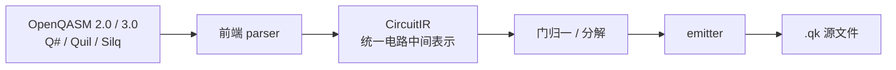

# qk 迁移手册

> 本手册说明如何把现有量子编程语言的程序**友好地迁移为 qk（`.qk`）源码**。
> 迁移产物是可读、可编辑、可编译的原生 qk 代码，随后可用 `qk run` / `qk compile` 正常执行。
>
> 相关文档：[README](../README.md) · [qk 语言手册](./qk-language-manual.md)。

---

## 目录

1. [概述](#1-概述)
2. [支持的源语言](#2-支持的源语言)
3. [使用方法](#3-使用方法)
4. [门映射表](#4-门映射表)
5. [迁移示例](#5-迁移示例)
6. [新增原生门](#6-新增原生门)
7. [限制与降级说明](#7-限制与降级说明)

---

## 1. 概述

qk 提供 **source-to-source 迁移**：把现有量子编程语言源码解析为统一电路中间表示
（CircuitIR），再由单一发射器生成 `.qk` 源码。架构为「多前端 + 单后端」：



- 地址模型采用**全局平坦 qubit / bit 索引**（对齐 OpenQASM 的寄存器展开），
  使各语言各异的寄存器 / 数组 / 单比特声明统一到同一张地址表。
- 迁移产物以 `QuantumRegister` 式逐个 `Qubit q<i> = alloc();` 声明，配合 qk
  **Qubit 层原生门**（`h` / `x` / `y` / `z` / `s` / `t` / `rx` / `ry` / `rz` /
  `cnot` / `toffoli` / `swap` / 受控门），门集完整、可读性高。

---

## 2. 支持的源语言

| 源语言 | 前端 | 覆盖子集 |
| --- | --- | --- |
| OpenQASM 2.0 | `migrate/qasm2.ts` | `qreg`/`creg`、内建门、参数化门（`u1/u2/u3/rx/ry/rz/...`）、`measure`、`barrier`、`reset`、`if`（单条 qop）、自定义 `gate` |
| OpenQASM 3.0 | `migrate/qasm3.ts` | `qubit[N]`/`bit[N]` 声明、内建门、`c = measure q;`、`for i in [lo:hi]`（循环展开）、`if`/`while`、经典变量（`int`/`bool`/`float`）、复杂布尔条件、自定义 `gate`、`reset`/`barrier` |
| Q# | `migrate/qsharp.ts` | `namespace`/`operation`、`use`/`using`、`H`/`CNOT`/`Rx(θ,q)` 等、`M`（测量）、`Reset` |
| Quil（Rigetti） | `migrate/quil.ts` | `DECLARE`、`H 0`/`CNOT 0 1`/`RX(pi/2) 0`、`MEASURE` |
| Silq（ETH） | `migrate/silq.ts` | `def`、`q := 0:𝔹`、`H(q)`/`rotZ(θ,q)`、`measure(q)` |

> 由于 Qiskit / Cirq / pyQuil / ProjectQ 都能导出 OpenQASM 2.0，**支持 OpenQASM 2.0
> 即可传递覆盖绝大多数 Python 系量子框架**。

---

## 3. 使用方法

```bash
# 显式指定源语言
qk migrate circuit.qasm --from openqasm2            # 生成 circuit.qk
qk migrate circuit.qasm --from openqasm3 -o out.qk  # 指定输出文件
qk migrate program.qs --from qsharp
qk migrate program.quil --from quil
qk migrate program.slq --from silq

# 自动探测源语言（按内容）
qk migrate circuit.qasm
```

迁移完成后，即可正常运行 / 编译：

```bash
qk run circuit.qk
qk ir  circuit.qk
qk compile x64 -e circuit.qk
```

**VS Code 右键菜单**：在编辑器或资源管理器中右键 `.qasm` / `.qs` / `.quil` / `.slq`
文件，选择 **「Migrate to qk」**，即可自动探测源语言并在同目录生成 `.qk` 文件，
结果回显到「Quark Console」输出通道。

> 说明：迁移命令复用语言服务器编译管线中的 `migrate/` 模块，无需额外安装；
> 迁移是纯文本转译（不连接 daemon），生成 `.qk` 后可用 ▶ 按钮或 `qk run` 正常执行。

---

## 4. 门映射表

OpenQASM 标准门库（`qelib1.inc`）到 qk 原生门的映射如下。qk 原生门之外的
门会被**自动分解**为原生门序列（到全局相位，物理可观测等价）。

| OpenQASM 门 | qk 迁移 | 方式 |
| --- | --- | --- |
| `h` `x` `y` `z` `s` `t` | `h` `x` `y` `z` `s` `t` | 原生 |
| `rx(θ)` `ry(θ)` `rz(θ)` | `rx(q, θ)` `ry(q, θ)` `rz(q, θ)` | 原生 |
| `cx` `ccx` `swap` `ch` `crz` `cswap` | `cx` `toffoli` `swap` `ch` `crz` `cswap` | 原生 |
| `sdg` / `tdg` | `rz(q, -π/2)` / `rz(q, -π/4)` | 分解 |
| `u1(λ)` | `rz(q, λ)` | 分解 |
| `u2(φ, λ)` | `rz(q, λ)·ry(q, π/2)·rz(q, φ)` | 分解 |
| `u3(θ, φ, λ)` / `u` | `rz(q, λ)·ry(q, θ)·rz(q, φ)` | 分解 |
| `cz` | `h(t)·cx(c, t)·h(t)` | 分解 |
| `cy` | `rz(t, π/2)·cx(c, t)·rz(t, -π/2)` | 分解 |
| `crx(θ)` | `h(t)·crz(c, t, θ)·h(t)` | 分解 |
| `cry(θ)` | `rz(t, π/2)·crx(θ)·rz(t, -π/2)` | 分解 |
| `id` / `barrier` | 忽略（`barrier` 保留为注释） | — |
| `measure` | `measure(q)` | 原生 |
| `reset` | 注释（qk Qubit 函数末尾隐式释放） | 降级 |

---

## 5. 迁移示例

### 5.1 OpenQASM 2.0 → qk（Bell 态）

输入 `bell.qasm`：

```qasm
OPENQASM 2.0;
include "qelib1.inc";
qreg q[2];
creg c[2];
h q[0];
cx q[0], q[1];
measure q[0] -> c[0];
measure q[1] -> c[1];
```

`qk migrate bell.qasm` 产物 `bell.qk`：

```qk
// 迁移自 qasm2（由 qk migrate 生成）

@layer(time=0, thread=0, coord=(0))
int32 quark_main() {
    Qubit q0 = alloc();
    Qubit q1 = alloc();

    int32 c0 = 0;
    int32 c1 = 0;

    h(q0);
    cx(q0, q1);
    c0 = measure(q0);
    c1 = measure(q1);
    return 0;
}
```

### 5.2 OpenQASM 3.0 → qk（自定义门 + 循环）

输入 `mycircuit.qasm`：

```qasm
OPENQASM 3.0;
qubit[3] q;
bit[3] c;
gate my_rot(angle a) q0 { rz(a) q0; }
h q[0];
for i in [0:3] {
    my_rot(0.1) q[i];
}
c = measure q;
```

产物（自定义门 → `@[gate]` 函数；`for` 展开）：

```qk
@[gate]
void my_rot(Qubit q0, double a) {
    rz(q0, a);
}

@layer(time=0, thread=0, coord=(0))
int32 quark_main() {
    Qubit q0 = alloc();
    Qubit q1 = alloc();
    Qubit q2 = alloc();

    int32 c0 = 0;
    int32 c1 = 0;
    int32 c2 = 0;

    h(q0);
    my_rot(q0, 0.1);
    my_rot(q1, 0.1);
    my_rot(q2, 0.1);
    c0 = measure(q0);
    c1 = measure(q1);
    c2 = measure(q2);
    return 0;
}
```

### 5.3 Q# → qk

输入 `bell.qs`：

```qsharp
namespace Quantum.Bell {
    operation Bell() : Result[] {
        use (q0, q1) = (Qubit(), Qubit());
        H(q0);
        CNOT(q0, q1);
        let r0 = M(q0);
        let r1 = M(q1);
        Reset(q0);
        Reset(q1);
        return [r0, r1];
    }
}
```

产物：

```qk
@layer(time=0, thread=0, coord=(0))
int32 quark_main() {
    Qubit q0 = alloc();
    Qubit q1 = alloc();

    int32 c0 = 0;
    int32 c1 = 0;

    h(q0);
    cx(q0, q1);
    c0 = measure(q0);
    c1 = measure(q1);
    return 0;
}
```

### 5.4 Quil → qk

输入 `bell.quil`：

```
DECLARE ro BIT[2]
H 0
CNOT 0 1
MEASURE 0 ro[0]
MEASURE 1 ro[1]
```

产物：

```qk
@layer(time=0, thread=0, coord=(0))
int32 quark_main() {
    Qubit q0 = alloc();
    Qubit q1 = alloc();

    int32 c0 = 0;
    int32 c1 = 0;

    h(q0);
    cx(q0, q1);
    c0 = measure(q0);
    c1 = measure(q1);
    return 0;
}
```

### 5.5 Silq → qk

输入 `bell.slq`：

```
def main() {
    q := 0:𝔹;
    q := H(q);
    x := measure(q);
    return x;
}
```

产物：

```qk
@layer(time=0, thread=0, coord=(0))
int32 quark_main() {
    Qubit q0 = alloc();

    int32 c0 = 0;

    h(q0);
    c0 = measure(q0);
    return 0;
}
```

---

## 6. 新增原生门

为提升迁移产物可读性，qk 语言层与 C++ 运行时补充了以下 Qubit 层原生门
（对齐 OpenQASM `qelib1.inc` 标准门库）：

| 门 | 语义 | C++ 后端默认实现 |
| --- | --- | --- |
| `y` | Pauli-Y | `X·Z`（差全局相位，态矢量后端重写为精确矩阵） |
| `z` | Pauli-Z（相位翻转） | `H·X·H`（态矢量后端重写为直接相位翻转） |
| `s` | S 门（π/2 相位） | `Rz(π/2)` |
| `t` | T 门（π/4 相位） | `Rz(π/4)` |
| `rx(θ)` | 绕 X 轴旋转 | `H·Rz(θ)·H` |
| `ry(θ)` | 绕 Y 轴旋转 | `Rz(-π/2)·Rx(θ)·Rz(π/2)` |

这些门在 Qubit 层可用（`y(q)` / `rx(q, 0.5)`），并纳入可逆编织
（`@[undo]`/`@[steer]`）的取逆规则：`y`/`z` 自逆，`rx`/`ry`/`rz` 取负角，
`s`/`t` 展开为 `rz` 取负角。

---

## 7. 限制与降级说明

## 已支持的进阶语义

- **`reset` 测后条件翻转**：含「中间 reset」（测后复用 qubit）的电路自动切换到
  **QObject 层**——`QuantumRegister` + `qgate_*` + `qmeasure`（部分坍缩）+ 条件翻转
  （`int32 _r = qmeasure(q, i); if (_r == 1) { qgate_x(q, i); }`），与 OpenQASM 的
  Born 规则坍缩语义一致；无中间 reset 的电路仍走 Qubit 层（门集完整、可读性高）。
- **经典控制流**：OpenQASM 3 经典变量（`int[32]`→`int32`、`bool`→`int32`、`float[64]`→`double`）、
  经典赋值（`x = x + 1`）、`while` 循环、复杂布尔 `if` 条件（`&&`/`||`/`!`/比较）均符号化
  转译为 qk 对应结构。

## 已知限制

当前迁移器聚焦**量子电路核心子集**，以下场景存在已知限制（后续迭代完善）：

| 限制 | 行为 |
| --- | --- |
| OpenQASM 3 `array[...]`（经典数组） | 未支持，降级/忽略 |
| Q# `M` 后 `Reset` 再复用 qubit | `M` → 消费式 `measure`，`Reset` 降级为注释（Q# 典型「测后释放」模式不受影响） |
| 参数化门的符号角度在顶层 | 仅常量角度（`pi` 视为符号，运行时无此常量） |
| OpenQASM 3 复杂算术表达式（位运算 / 函数调用） | 仅简单算术与比较（`+`/`-`/`*`/比较），其余原样透传 |

> 迁移产物已通过 qk 现有编译管线（`Lexer → Parser → SemanticAnalyzer`）的
> 端到端校验（见 `server/src/migrate.test.ts`），确保生成的 `.qk` 语义合法。